Գլուխ 1

Սփլայներ և դրանց կիրառությունների մասին

Ներածություն

Հարթության վրա տրված կետերի հաջորդականությունը հատուկ տիպի սփլայնով մոտարկման մեթոդը ներառում է խնդրի լուծման երկփուլային սխեմա [1]: Առաջին փուլը բաղկացած է սփլայնի տարրերի քանակի և դրա պարամետրերի մոտավոր արժեքների գտնելուց՝ օգտագործելով դինամիկ ծրագրավորման մեթոդը: Երկրորդ փուլում, ստացված սփլայնը որպես նախնական մոտավորություն օգտագործելով, դրա պարամետրերը օպտիմալացվում են ոչ գծային ծրագրավորման միջոցով:Ներկայացված աշխատանքում դիտարկված են շրջանագծերով և ուղիղներով զուգակցված կլոտոիդներով սփլայների օգտագործման երկրորդ փուլի կիրառումը։
Սփլայնը բաղկացած է կրկնվող կապից՝ «գծի հատվածից + կլոտոիդային աղեղից + շրջանաձև աղեղից + կլոտոիդային աղեղից...»: Հետագայում «աղեղ» բառը բաց կթողնվի կարճության համար, եթե դա չի ստեղծի երկիմաստություն։ Այս փուլում հայտնի են դրա մեջ գտնվող շոշափողի սկզբնակետը և ուղղությունը, բոլոր կորերի երկարությունները և դրանք զուգորդող գծերը, ինչը թույլ է տալիս կիրառել անընդհատ օպտիմալացման մեթոդներ, մասնավորապես՝ գրադիենտային տիպի ոչ գծային ծրագրավորման մեթոդներ, չնայած այն հանգամանքին, որ ցանկալի սփլայնը, ընդհանուր առմամբ, բազմարժեք ֆունկցիա է։ Խնդիրը դիտարկվում է երկաթուղիների և մայրուղիների երթուղային պլանի նախագծման հետ կապված, որտեղ, ի տարբերություն այլ գծային կառուցվածքների, օրինակ՝ խողովակաշարերի, կլուտոիդային գծերը պարտադիր են կորության անընդհատությունը և, համապատասխանաբար, երթևեկության հարմարավետությունն ու անվտանգությունն ապահովելու համար ։
Պետք է նշել, որ ընդունված մոտեցումը զգալիորեն տարբերվում է նախագծային պրակտիկայում ընդունված տարրերի ինտերակտիվ ռեժիմով ընտրության մեթոդից, կորության գրաֆիկների և անկյունային դիագրամների հիման վրա կորերի սահմանները գտնելու տարբեր կիսաավտոմատ մեթոդներից, ինչպես նաև կորերի սահմանները գտնելու նոր էվրիստիկ մեթոդից [3]՝ գենետիկական օպտիմալացման ալգորիթմների հետագա կիրառմամբ։
Նպատակներ։ Աշխատանքի նպատակն է մշակել հարթության վրա կետերի հաջորդականության սփլայնային մոտարկման տեսությունը՝ բարդ կառուցվածքի սփլայնների օգտագործման դեպքում,որը կիրառվում է մայրուղիներ նախագծելու համար։ Ի տարբերություն պարզ, օրինակ՝ բազմանդամային սփլայնի, բաղադրյալ սփլայնը պարունակում է մի քանի տարրերի կրկնվող կապեր(փնջեր)։ Նման խնդիր առաջանում է երկաթուղային և մայրուղիների նախագծման ժամանակ։ Նման երթուղու հատակագիծը (պրոյեկցիան հորիզոնական հարթության վրա) կոր է, որը բաղկացած է տարրերի կրկնվող փնջից՝ «ուղիղ գիծ + կլոտոիդ + շրջան + կլոտոիդ...», որը ապահովում է ոչ միայն կորի և շոշափողի,այլև կորության անընդհատությունը։ Սփլայնի տարրերի քանակը անհայտ է և պետք է որոշվի նախագծային խնդիրը լուծելու ընթացքում։ Ընդհանուր դեպքում, մոտարկող սփլայնը բազմարժեք ֆունկցիա է։ Նրա գրաֆիկի կետերի կոորդինատների վրա կարող են դրվել սահմանափակումներ։ Մեկ այլ նշանակալի գործոն, որը բարդացնում է խնդիրը, կլոտոիդների առկայությունն է, որոնք անալիտիկորեն (բանաձևով) չեն արտահայտվում: Ներկայացված աշխատանքում դիտարկվում է սփլայնի ոչ գծային ծրագրավորման կիրառմամբ լավարկման խնդրի լուծումը։
Մեթոդներ: Սփլայնի պարամետրերը օպտիմալացնելու համար օգտագործվում է նոր մաթեմատիկական մոդել՝ փոփոխված Լագրանժի ֆունկցիայի տեսքով և հատուկ ոչ գծային ծրագրավորման ալգորիթմ: Այս դեպքում հնարավոր է անալիտիկորեն հաշվարկել նպատակային ֆունկցիայի ածանցյալները սփլայնի պարամետրերի նկատմամբ՝ այդ պարամետրերով դրա անալիտիկ արտահայտության բացակայության դեպքում:
Արդյունքներ: Մշակվել են բաղադրյալ սփլայնի պարամետրերի օպտիմիզացիայի մաթեմատիկական մոդելը և ալգորիթմը,ընդ որում սփլայնը կազմված է շրջանագծերի աղեղներից,զուգակցված կլոտոիդներով և ուղիղներով։
§1.2 Սփլայնի սահմանումը
Մոտարկման դասական խնդիրը տանում է հետևյալին․
$OXY$ կոորդինատական հարթությունում տրված են $M\left( x_{0},y_{0} \right),\ldots,M_{n}\left( x_{n},y_{n} \right),$ կետեր $\left( x_{0} < x_{1} < ... < x_{n} \right)$ պահանջվում է գտնել <<ֆունկցիա>>,որի գրաֆիկն անցնում է տրված $n + 1\ \ $հատ կետերով:Որպես այդ խնդրի լուծում ֆունկցիան փնտրվում է $n$-րդ աստիճանի $L_{n}(x)\ $բազմանդամի տեսքով։
Գտնենք $L_{n}(x)\ \ $բազմանդամը։Այդ բազմանդամը փնտրենք հետևյալ տեսքով․
$$L_{n}(x) = \sum_{i = 0}^{n}{y_{i}C_{i}(x)},$$
որտեղ $y_{i}$-երը հայտնի են։Փնտրենք $C_{i}(x)$ բազմանդամի տեսքը այնպես,որ $L_{n}(x)\ \ $ բազմանդամի արժեքը $x_{j}$ կետում լինի $y_{j}$ ,այսինքն՝
$$L_{n}\left( x_{j} \right) = y_{j} = y_{0}C_{0}\left( x_{j} \right) + \ldots + y_{j}C_{j}\left( x_{j} \right) + \ldots + y_{n}C_{n}\left( x_{j} \right);$$
$$C_{i}\left( x_{j} \right) = \delta_{ij} = \left{ \begin{array}{r}
1,\ i\  = j \
0,i \neq j
\end{array} \right.\ ։$$
Ակնհայտ է,որ $C_{i}(x)$ բազմանդամները պետք է ունենան հետևյալ տեսքը․
$$C_{i}(x) = A_{i}\left( x - x_{0} \right)\left( x - x_{1} \right)․․․\left( x - x_{i - 1} \right)\left( x - x_{i + 1} \right),$$
$$\left( x - x_{n} \right) = A_{i}\prod_{k = 0(k \neq j)}^{n}\left( x - x_{k} \right),$$
որտեղ $A_{i} = const,\ \ i = 0,1,\ldots n$:
$A_{i}$ հաստատունը ընտրենք այնպես,որ $C_{i}(x) \equiv 1 \Rightarrow$
$$A_{i}\left( x - x_{0} \right)\left( x - x_{1} \right)․․․\left( x - x_{i - 1} \right)\left( x - x_{i + 1} \right)․․․\left( x_{i} - x_{n} \right) = 1\  \Rightarrow$$
$$A_{i} = \frac{1}{\prod_{k = 0(k \neq j)}^{n}\left( x - x_{k} \right)}։$$
Տեղադրելով կստանանք
$$L_{n}(x) = \sum_{i = 0}^{n}{y_{i}C_{i}(x)} = \sum_{i = 0}^{n}{y_{i}\frac{\prod_{k = 0(k \neq i)}^{n}\left( x - x_{k} \right)}{\prod_{k = 0(k \neq i)}^{n}\left( x_{i} - x_{k} \right)}}$$
Այն կոչվում է Լանգրանժի ինտերպոլացիոն բազմանդամ։
Նկարագրված խնդիրը Լանգրանժի բազմանդամով լուծելիս առաջանում են 2 հիմնական խնդիրներ․
$M_{i}\ $հանգույցների քանակը ավելացնելիս բազմանդամի աստիճաը ավելանում է
որոշակի $\ M_{i}\ $ կետերի ընտրության դեպքում կառուցված բազմանդամի գրաֆիկը էապես կարող է տարբերվել սկզբնական $f(x)$ ֆունկցիայի գրաֆիկից։
Օրինակ $f(x) = \frac{1}{1 + 25x^{2}}$ $x \in \lbrack - 1,1\rbrack$ (Ռունգե)
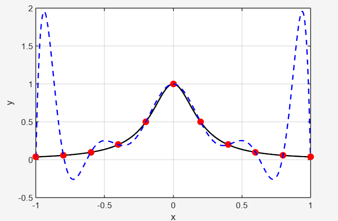
Նկ․1․1
Նկ․1-ում պատկերված է այդ $f(x)$ ֆունկցիայի գրաֆիկը և 11 հանգուցային կետերում այդ $f(x)$ ֆուկցիայի $L_{n}(x)$ Լանգրանժի ինտերպոլացիոն բազմանդամը։Հանգույցային կետերի քանակը ավելացնելիս մեծանում է $L_{n}(x)$ ինտերպոլացիոն բազմանդամի աստիճանը և,ինչպես երևում է նկ․1․1-ից,եզրային մասերում մոտարկող $L_{n}(x)$ բազմանդամը տալիս է բավականին մեծ շեղումներ։
Առաջարկված խնդրիների հանգուցալուծման համար կարելի է գնալ հետևյալ ճանապարհով․մոտարկումը կատարել կտոր առ կտոր,արդյունքում ստացվում են սփլայներ։
§1.3 Մի շարք սփլայների տեսակները
<u>Սահմ․</u>*Դիցուք տրված են $M_{0}\left( x_{0},y_{0} \right),\ldots,M_{n}\left( x_{n},y_{n} \right)$ հանգուցային կետերը։Սփլայն է կոչվում այն կորը,որն անցնում է նշված բոլոր հանգույցներով,2 հարևան $M_{i}$, $M_{i + 1}$հանգուցային կետերը իրար միացնող կտորը $m$-րդ աստիճանի բազմանդամ է,ընդ որում նշված հանգույցներում գոյություն ունի մինչև* $(m$ - 1)-րդ կարգն անընդհատ ածանցյալ։
Դիտարկենք սփլայների մի շարք մասնավոր դեպքեր․
1․m=1(բեկյալ) $x_{0} < x_{1} < \ldots < x_{n}$,պարզ է որ $S_{i}$ օղակի բանաձևը
$$\frac{x - x_{i}}{x_{i + 1} - x_{i}} = \frac{y - y_{i}}{y_{i + 1} - y_{i}} \Rightarrow$$
$$y = y_{i} + \frac{y_{i + 1} - y_{i}}{x_{i + 1} - x_{i}}\left( x - x_{i} \right)\ \ i = 0,1,\ldots n - 1;x \in \left\lbrack x_{i},x_{i + 1} \right\rbrack\ $$
$S_{i}$ օղակի բանաձևը կարելի է ներկայացնել պարամետրական տեսքով․
$$\left{ \ \ \ \begin{array}{r}
x = x_{i} + \left( x_{i + 1} - x_{i} \right)t\ \ \  \
y = y_{i} + \left( y_{i + 1} - y_{i} \right)t\ \ \ \
\end{array} \right.\ \ t \in \lbrack 0,1\rbrack ։$$
Բեկյալ սփլայնի տեսքը ներկայացված է նկ․1․2-ում։
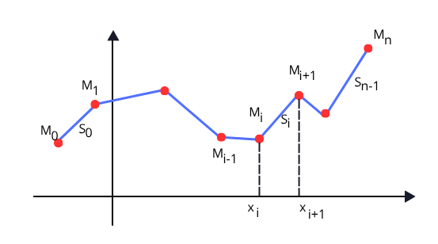
Նկ․ 1․2
Կառուցված բեկյալը անընդհատ է,սակայն ներքին հանգուցային կետերում առաջին կարգի ածանցյալը կարող է ունենալ խզումներ։
2․m=2(քառակուսային սփլայն)
Դիցուք տրված են $M_{0}\left( x_{0},y_{0} \right),\ldots,M_{n}\left( x_{n},y_{n} \right)$ հանգուցային կետերը $(x_{0} < x_{1} < \ldots < x_{n})։$ Կառուցենք այդ կետերով անցնող քառակուսային սփլայն։Ինչպես նշվել է սփլայնի սահմանման մեջ, $M_{i}$($i = 1,2,\ldots n - 1$) կետերում սփլայնը պետք է ունենա առաջին կարգի անընդհատ ածանցյալ։
$S_{i}$ կտորի բանաձևի համար կարող ենք գրել․
$$S_{i}(x) = a_{i} + b_{i}\left( x - x_{i} \right) + c_{i}\left( x - x_{i} \right)^{2}\ ;\ \ i = 0,1,\ldots n - 1։\ \ \ \ \ \ \ \ \ \ \ \ \ \ \ \ \ \ \ \ \ \ \ \ \ (1․1)\ $$
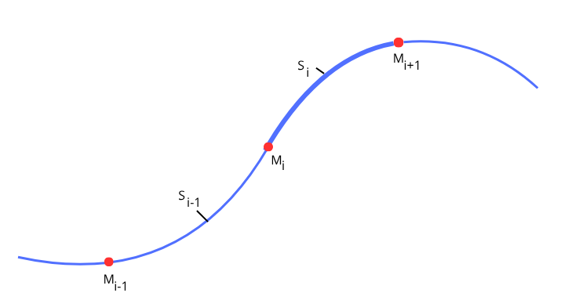
Նկ․ 1․3
Քանի որ $S_{i}\left( x_{i} \right) = y_{i} \Rightarrow a_{i} = y_{i}$:Բոլոր $y_{i}$-ը հայտնի են ուստի $(1․1)$-ի մեջ մնացել է գտնել $b_{i},\ c_{i}$ գործակիցները (ընդհանուր 2$n$ հատ անհայտ)։
Ունենք՝$\ \ \ \ \ \ \ \ \ \ \ \ \ \ \ \ \ \ \ \ $
$$\left. \ \begin{matrix}
S_{i}\left( x_{i + 1} \right) = y_{i + 1}, \
\begin{matrix}
y_{i} + b_{i}\left( x_{i + 1} - x_{i} \right) + c_{i}\left( x_{i + 1} - x_{i} \right)^{2} = y_{i + 1}, \
\begin{matrix}
b_{i} + c_{i}h_{i} = \Delta_{i}\ \ (i = 0,1,\ldots n - 1), \
h_{i} = x_{i + 1} - x_{i}, \
\Delta_{i} = \frac{y_{i + 1} - y_{i}}{x_{i + 1} - x_{i}}:
\end{matrix}
\end{matrix}
\end{matrix} \right}\ \ \ \ \ \ \ \ \ \ \ \ \ \ \ \ \ \ \ \ \ \ \ \ \ \ \ \ \ \ \ (1․2)$$
$$\ \ $$
$M_{i}$ կետում կորի առաջին կարգի ածանցյալի անընդհատությունից կունենանք․
$$\left. \ \begin{matrix}
S_{\mathbb{i} - 1}^{'}\left( x_{i} \right) = S_{\mathbb{i}}^{'}\left( x_{i} \right), \
b_{i - 1} + 2c_{i - 1}h_{i - 1} = b_{i}\ \ (i = 1,2,\ldots n - 1)
\end{matrix} \right}:\ \ \ \ \ \ \ \ \ \ \ \ \ \ \ \ \ \ \ \ \ \ \ \ \ \ \ \ \ \ \ \ \ \ \ \ \ \ \ \ \ \ \ (1․3)$$
$(1․2)$ և $(1․3)$ առնչությունների ընդհանուր քանակը $2n - 1$ է(նկ․3)։Մեզ հարկավոր է ևս մեկ առնչություն,որպեսզի գտնենք $b_{i}$ և $c_{i}\ \ $բոլոր գործակիցները։Որպես մեկ լրացուցիչ պայման,կիրառում են հետևյալ երկու մոտեցումներից մեկը․
ա) ձախից բնական պայման․$c_{0} = 0$,
բ) ձախից կորի թեքման պայման․ $S_{0}՛\left( x_{0} \right) = m_{0}$, այսինքն $b_{0} = m_{0}$($m_{0}$-ն տրված է լինում ի սկզբանե)։
$(1․2)$-ից $i = 0$ դեպքում կստանանք՝
$$m_{0} = b_{0} = \Delta_{0}\  - c_{0}h_{0}:$$
Վերը նշված ա) կամ բ) պայմաններին համապատասխան առնչությունը կարող ենք գրել․
$\alpha C_{0} = \beta\ \ \ \ \ \ \ \ \ \ \ \ \ \ \ \ \ \ \ \ $ $(1․4)$
ընդ որում
ա) դեպքում կարող ենք վերցնել $\alpha = 1;\ \beta = 0$,
բ) դեպքում կվերցնենք $\alpha = h_{0},\ \beta = \Delta_{0} - m_{0}$։
$(1․2)$-ից $i = 1,2,\ldots n - 1$ արժեքների համար,կունենանք՝
$$b_{i} = \Delta_{i}\  - c_{i}h_{i},$$
$$b_{i - 1} = \Delta_{i - 1}\  - c_{i - 1}h_{i - 1},$$
որոնք տեղադրելով $(1․3)$-ի մեջ կստանանք․
$${\ \ \ \ \ \ \ \ \ \ \ \ \ \ \ \ \ \ \ \ \ \ \ \ \ \ \ \ \ \ \ \ \ \ \ \ \ \ \ \ \ \ \ \ \ \ \ \ \ \Delta}{i - 1}\  - c{i - 1}h_{i - 1} + 2c_{i - 1}h_{i - 1} = \Delta_{i}\  - c_{i}h_{i\ \ \ \ \ \ \ \ \ \ \ \ \ \ \ \ \ \ \ \ \ \ \ \ \ \ \ \ \ \ \ \ \ \ \ \ \ \ \ \ \ \ }\ \ \ \ \ \ \ \ \ \ \ \ \ \ \ $$
$c_{i - 1}h_{i - 1} + c_{i}h_{i} = \Delta_{i} - \Delta_{i - 1}\ ,\ \ \ (i = 1,\ldots n - 1)\ ։$ $\ \ (1․5)$
Նշանակելով $r_{i}$ =$\ \Delta_{i} - \Delta_{i - 1}$, $(1․4)\ \ $ և$\ \ \ (1․5)\ \ $առնչությունները կարող ենք գրել հետևյալ մատրիցային հավասարման տեսքով
$$\underset{A\ }{\overset{\left( \begin{array}{r}
\alpha \
h_{0} \
0 \
․․․ \
0
\end{array}\ \ \begin{array}{r}
0 \
h_{1} \
h_{1} \
․․․ \
0
\end{array}\ \ \begin{array}{r}
0 \
0 \
h_{2} \
․․․ \
0
\end{array}\ \ \begin{array}{r}
0 \
0 \
0 \
․․․ \
0
\end{array}\ \ \begin{array}{r}
․․․ \
․․․ \
․․․ \
․․․ \
․․․
\end{array}\ \ \begin{array}{r}
0 \
0 \
0 \
․․․ \
h_{n - 2}
\end{array}\ \ \begin{array}{r}
0 \
0 \
0 \
․․․ \
h_{n - 1}
\end{array} \right)}{︸}}\underset{C}{\overset{\left( \begin{array}{r}
c_{0} \
c_{1} \
c_{2} \
․․․ \
c_{n - 1}
\end{array} \right)\ }{︸}} = \underset{r}{\overset{\left( \begin{array}{r}
\ \beta \
r_{1} \
r_{2} \
․․․ \
r_{n - 1}
\end{array} \right)}{︸}\ },\ \ \ \ \ \ \ \ \ \ \ \ \ \ \ \ \ \ \ \ \ \ \ \ \ \ \ \ (1․6)$$
$A \bullet C = r\ $ $\ \ (1․6')$
Քանի որ $A - ն\ $ը երկանկյունագծային քառակուսային մատրից է,որ ի
$$\det A = \alpha \cdot h_{1} \cdot h_{2} \bullet ․․․ \bullet h_{n - 1} \neq 0,$$
ուստի գոյություն ունի$\ A^{- 1}$ հակադարձ մատրիցը։$(1․6')$-ից կգտնենք $c_{i}$ անհայտ գործակիցների սյունը․
$$C = A^{- 1}r։$$
Ստացված $c_{i}$ արժեքները տեղադրելով $(1․2)$-ի$\ $մեջ կգտնենք բոլոր $b_{i}$ գործակիցները։
3․m=3 (խորանարդային սփլայն)
Դիցուք տրված են $M_{0}\left( x_{0},y_{0} \right),\ldots,M_{n}\left( x_{n},y_{n} \right)$ հանգուցային կետերը $(x_{0} < x_{1} < \ldots < x_{n})։$ Կառուցենք այդ կետերով անցնող խորանարդային սփլայն ։Սփլայնի սահմանման համաձայն, $M_{i}$ ներքին հանգուցային կետերում ($i = 1,2,\ldots n - 1$) սփլայնը պետք է ունենա մինչև երկրորդ կարգի անընդհատ ածանցյալ։
$S_{i}$ սեկտորի բանաձևի համար կարող ենք գրել․
$$S_{i}(x) = a_{i} + b_{i}\left( x - x_{i} \right) + c_{i}\left( x - x_{i} \right)^{2}\  + d_{i}\left( x - x_{i} \right)^{3};i = 0,1,\ldots n - 1\ \ \ \ \ \ \ \ \ \ \ \ \ \ \ \ \ \ \ \ (1․7)$$
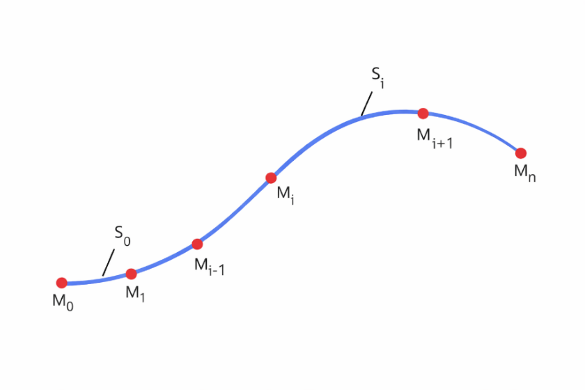
Նկ․ 1․4
Քանի որ $S_{i}\left( x_{i} \right) = y_{i} \Rightarrow a_{i} = y_{i}$:Բոլոր $y_{i}$-ը հայտնի են ուստի $(1․7)$-ի մեջ մնացել է գտնել $b_{i},\ c_{i},d_{i}$ գործակիցները (ընդհանուր 3$n$ հատ անհայտ)։
$$S_{i}\left( x_{i + 1} \right) = y_{i + 1}\ \ \ ( = S_{i + 1}\left( x_{i + 1} \right)),$$
$$a_{i} + b_{i}\left( x_{i + 1} - x_{i} \right) + c_{i}\left( x_{i + 1} - x_{i} \right)^{2} + d_{i}\left( x - x_{i} \right)^{3} = y_{i + 1},$$
$$b_{i}h_{i} + c_{i}{h_{i}}^{2} + d_{i}{h_{i}}^{3} = y_{i + 1} - y_{i},$$
${\ \ \ \ \ \ \ \ \ \ \ \ \ \ \ \ \ \ \ \ \ \ \ \ \ \ \ \ \ \ \ \ \ \ \ \ \ \ \ \ b}{i} = \frac{y{i + 1} - y_{i}}{h_{i}} - c_{i}h_{i} - d_{i}h_{i}^{2}\ \ \ \ \ \ \ (i = 0,1,\ldots n - 1)\ \ \ \ \ \ \ \ \ \ \ \ \ \ \ \ \ \ \ \ \ \ \ \ \ \ $ $\ \ (1․8)$
$h_{i} = x_{i + 1} - x_{i}$,
$2c_{i} = m_{i}$։
$(1․7)$-ից՝ *  
*$$S_{\mathbb{i} - 1}^{'}\left( x_{i} \right) = b_{i} + 2c_{i}\left( x - x_{i} \right) + 3d_{i}\left( x - x_{i} \right)^{2},$$
$$S_{\mathbb{i}}^{''}\left( x_{i} \right) = \ 2c_{i} + 6d_{i}\left( x - x_{i} \right)։$$
$M_{i}$ կետում կորի առաջին կարգի ածանցյալի անընդհատությունից կունենանք․
$$S_{\mathbb{i}}^{'}\left( x_{i} \right) = S_{\mathbb{i} - 1}^{'}\left( x_{i} \right),$$
$$b_{i} = b_{i - 1} + m_{i - 1}\left( x_{i} - x_{i - 1} \right) + 3d_{i - 1}\left( x_{i} - x_{i - 1} \right)^{2},$$
$$b_{i} - b_{i - 1} = m_{i - 1}h_{i - 1} + 3d_{i - 1}{h_{i - 1}}^{2},\ \ \ \ \ \ \ (i = 1,2,\ldots n - 1)\ \ \ \ \ \ \ \ \ \ \ \ \ \ \ \ \ \ \ \ \ \ \ \ \ \ \ \ (1․9)$$
Երկրորդ կարգի ածանցյալի անընդհատության պայմանից կստանանք․
$$S_{\mathbb{i}}^{''}\left( x_{i} \right) = S_{\mathbb{i} - 1}^{''}\left( x_{i} \right)\ \ (i = 1,2,\ldots n - 1)$$
$$2c_{i} = \ 2c_{i - 1} + 6d_{i - 1}\left( x_{i} - x_{i - 1} \right);$$
$$m_{i} = \ m_{i - 1} + 6d_{i - 1}h_{i - 1};$$
$${\ \ \ \ \ \ \ \ \ \ \ \ \ \ \ \ \ \ \ \ \ \ \ \ \ \ \ \ \ \ \ \ \ \ \ \ \ \ \ \ \ \ \ \ \ \ \ \ \ \ \ \ \ \ \ \ \ \ \ \ \ \ \ \ \ \ \ \ \ \mathbb{d}}{i} = \frac{m{i + 1} - m_{i}}{6h_{i}}։\ \ \ \ \ \ \ \ \ \ \ \ \ \ \ \ \ \ \ \ \ \ \ \ \ \ \ \ \ \ \ \ \ \ \ \ \ \ \ \ \ \ \ \ \ \ \ \ \ \ \ \ \ \ \ \ \ \ \ \ \ (1․10)$$
$(1․10)$-ը տեղադրելով $(1․8)$-ի մեջ,կունենանք․
$${\ \ \ \ \ \ \ \ \ \ \ \ \ \ \ \ \ \ \ \ \ \ \ \ \ \ \ \ \ \ \ \ \ \ b}{i} = \frac{y{i + 1} - y_{i}}{h_{i}} - \frac{h_{i}}{6}\left( 2m_{i} + m_{i + 1} \right),\ \ \ \ \ (i = 0,1,\ldots n - 2)\ \ \ \ \ \ \ \ \ \ \ \ \ \ \ \ \ \ \ \ \ \ \ \ (1․11)$$
$(1․10)$-ը և $(1․11)$-ը տեղադրելով $(1․9)$-ի մեջ և կատարելով որոշ պարզեցումներ,կստանանք․
$$h_{i - 1}m_{i - 1} + 2\left( h_{i} + h_{i - 1} \right)m_{i} + h_{i}m_{i + 1} = 6\left( \frac{y_{i + 1} - y_{i}}{h_{i}} + \frac{y_{i} - y_{i - 1}}{h_{i - 1}} \right),\ \ \ (i = 1,\ldots n - 2)\ \ \ \ \ \ \ \ \ \ (1․12)$$
Այժմ մտովի պատկերացնենք,որ ևս մեկ $M_{n + 1}$ հանգուցային կետ է ավելացվում։Այդ դեպքում $(1․12)$-ը կլինի ճիշտ նաև $i = n - 1$ դեպքում։
$$h_{i - 1}m_{i - 1} + 2\left( h_{i} + h_{i - 1} \right)m_{i} + h_{i}m_{i + 1} = 6\left( \frac{y_{i + 1} - y_{i}}{h_{i}} + \frac{y_{i} - y_{i - 1}}{h_{i - 1}} \right),(i = 1,\ldots n - 1)\ \ \ \ \ \ \ \ \ (1․13)$$
Այժմ $m_{i}$-ի քանակը $(n + 1)$ հատ է,իսկ $(1․13)$-ում ունենք$\ (n - 1)$ հատ հավասարում։ Պակասող երկու առնչությունները փնտրենք հետևյալ բնական ենթադրություններից․
ա) $S_{0}՛՛\left( x_{0} \right) = 0$, $S_{n - 1}՛՛\left( x_{n} \right) = 0$,( բնական սփլայն)
բ) $S_{0}՛\left( x_{0} \right) = p$, $S_{n - 1}՛\left( x_{n} \right) = q$։ (եզրային կետերում տրված են ածանցյալները)
Դիտարկենք ա) դեպքը։
$$S_{0}՛՛\left( x_{0} \right) = 2c_{0} = 0 \Rightarrow m_{0} = 0,$$
$$S_{n - 1}՛՛\left( x_{n} \right) = 2c_{n - 1} + 6d_{n - 1}h_{n - 1} = 0,$$
որի մեջ տեղադրելով $(1․10)$-ը (հաշվի առնելով,որ այն ճիշտ է նաև $i = n$ դեպքում,ըստ վերը նշված պատկերավոր վերցված $M_{n + 1}\ $կետի),կստանանք.
$$m_{n - 1} + \left( m_{n} - m_{n - 1} \right) = 0,$$
$$m_{n} = 0:$$
Կատարելով նաև հետևյալ նշանակումը․
$$r_{i} = 6\left( \frac{y_{i + 1} - y_{i}}{h_{i}} - \frac{y_{i} - y_{i - 1}}{h_{i - 1}} \right),(i = 1,\ldots n - 1)$$
$(1․13)$ համակարգը $m_{0} = m_{n} = 0$ պայմանների հետ միասին կարելի է գրել հետևյալ մատրիցային հավասարման տեսքով․
$$\overset{A}{\overbrace{\left( \begin{array}{r}
1 \
h_{0} \
... \
... \
0 \
0
\end{array}\begin{array}{r}
0 \
{\ \ \ 2(h}{0} + h{1}) \
... \
... \
0 \
0
\end{array}\begin{array}{r}
0 \
h_{1} \
... \
... \
0 \
0
\end{array}\begin{array}{r}
\ \ \ 0\ \ \ \ \ \ \ \ \ \ \ \ \ \ \  \
\ \ \ 0\ \ \ \ \ \ \ \ \ \ \ \ \ \ \  \
\ \ \ ...\ \ \ \ \ \ \ \ \ \ \ \ \ \  \
... \
\ 0\ \ \ \ \ \ \ \ \ \ \ \ \  \
0\ \ \ \ \ \ \ \ \ \ \ \
\end{array}\begin{array}{r}
...\ \ \ \  \
...\ \ \ \  \
...\ \ \ \  \
...\ \ \ \  \
...\ \ \ \  \
...\ \ \
\end{array}\begin{array}{r}
\ 0\ \ \ \ \ \  \
0\ \ \ \ \  \
...\ \ \ \ \  \
h_{n - 3}\  \
0\ \ \  \
\ 0\ \ \ \
\end{array}\begin{array}{r}
0 \
0 \
... \
{\ 2(h}{n - 3} + h{n - 2}) \
h_{n - 2} \
0
\end{array}\begin{array}{r}
0 \
0 \
... \
\ {\ h}{n - 2} \
{\ 2(h}{n - 1} + h_{n - 2}) \
0
\end{array}\begin{array}{r}
0 \
0 \
... \
0 \
\ \ \ h_{n - 1}\ \  \
\ \ \ 1\ \
\end{array} \right)}}\overset{M}{\overbrace{\left( \begin{array}{r}
m_{0} \
m_{1} \
m_{2} \
... \
m_{n - 1} \
m_{n}
\end{array} \right)}} =$$
$= \underset{r}{\overset{\left( \begin{array}{r}
0 \
r_{1} \
r_{2} \
... \
r_{n - 1} \
0
\end{array} \right)}{︸}}$։
Այժմ անցնենք բ) դեպքին․
$$S_{0}^{'}(x) = b_{0} + 2c_{0}\left( x - x_{0} \right) + 3d_{0}\left( x - x_{0} \right)^{2};\ S_{0}^{'}(x) = p \Rightarrow$$
${\ \ \ \ \ \ \ \ \ \ \ \ \ \ \ \ \ b}_{0} = p\ \ \ \ \ \ \ \ \ \ \ \ \ \ \ \ \ \ \ \ \ \ \ \ \ \ \ \ \ \ \ \ \ \ \ \ \ \ $ $\ (1․14)$
$$S_{n - 1}^{'}(x) = b_{n - 1} + 2c_{n - 1}\left( x - x_{n - 1} \right) + 3d_{n - 1}\left( x - x_{n - 1} \right)^{2};\ S_{n - 1}^{'}(x) = q\ $$
$$\ \ \ \ \ \ \ \ \ \ \ \ \ \ \ \ \ \ \ \ \ \ \ \ \ \ \ \ \ \ \ \ \ \ \ \ \ \ \ \ \ \ \ \ \ \ \ \ \ \ \ \ \ \ \ b_{n - 1} + 2m_{n - 1}h_{n - 1} + 3d_{n - 1}{h_{n - 1}}^{2} = q\ \ \ \ \ \ \ \ \ \ \ \ \ \ \ \ \ \ \ \ \ \ \ \ \ \ \ \ \ \ \ \ \ \ \ \ \ (1․15)$$
$(1․14)$-ը տեղադրելով $(1․11)$-ի մեջ,կստանանք․
$$p = \frac{y_{1} - y_{0}}{h_{0}} - \frac{h_{0}}{6}\left( 2m_{0} + m_{1} \right),$$
$$\ \ \ \ \ \ \ \ \ \ \ \ \ \ \ \ \ \ \ \ \ \ \ \ \ \ \ \ \ \ \ \ \ \ \ \ \ \ \ \ \ \ \ \ \ \ \ \ \ \ \ \ \ \ \ \ \ \ \ \ \ 2m_{0} + m_{1} = \frac{6}{h_{0}}(\frac{y_{1} - y_{0}}{h_{0}} - p)\ \ \ \ \ \ \ \ \ \ \ \ \ \ \ \ \ \ \ \ \ \ \ \ \ \ \ \ \ \ \ \ \ \ \ \ \ \ \ \ \ \ \ \ \ \ \ \ \ \ \ \ (1․16)$$
$(1․10)$-ի մեջ վերցնենք $i = n$(հաշվի առնելով պատկերավոր վերցված $M_{n + 1}\ $կետը)
$$d_{n - 1} = \frac{m_{n} - m_{n - 1}}{6h_{n - 1}}:$$
Նույն ձևով $(1․11)$-ի մեջ վերցնենք $i = n - 1$
$$b_{n - 1} = \frac{y_{n} - y_{n - 1}}{h_{n - 1}} - \frac{h_{n - 1}}{6}\left( 2m_{n - 1} + m_{n} \right):$$
Վերջիններս տեղադրելով $(1․15)$-ի մեջ, կստանանք․
$$\frac{y_{n} - y_{n - 1}}{h_{n - 1}} - \frac{h_{n - 1}}{6}\left( 2m_{n - 1} + m_{n} \right) + m_{n - 1}h_{n - 1} + \frac{m_{n} - m_{n - 1}}{2}h_{n - 1} = q;$$
$$\frac{y_{n} - y_{n - 1}}{h_{n - 1}} - q + \frac{m_{n - 1} + 2m_{n}}{6}h_{n - 1} = 0;$$
$$\ \ \ \ \ \ \ \ \ \ \ \ \ \ \ \ \ \ \ \ \ \ \ \ \ \ \ \ \ \ \ \ \ \ \ \ \ \ \ \ \ \ \ \ \ \ \ \ \ \ \ m_{n - 1} + 2m_{n} = \frac{6}{h_{n - 1}}\left( q - \frac{y_{n} - y_{n - 1}}{h_{n - 1}} \right)\ \ \ \ \ \ \ \ \ \ \ \ \ \ \ \ \ \ \ \ \ \ \ \ \ \ \ \ \ \ \ \ \ \ \ \ \ \ \ \ \ \ \ \ \ \ (1․17)$$
Հաշվի առնելով $(1․16)$-ը և $(1․17)$-ը, $m_{i}$-ը գտնելու համար կստանանք հետևյալ մատրիցային հավասարումը․
$$\overset{A}{\overbrace{\left( \begin{array}{r}
2 \
h_{0} \
... \
... \
0 \
0
\end{array}\begin{array}{r}
1 \
{\ \ \ 2(h}{0} + h{1})\ \  \
... \
... \
0 \
0
\end{array}\begin{array}{r}
0 \
h_{1} \
... \
... \
0 \
0
\end{array}\begin{array}{r}
\ \ \ 0\ \ \ \ \ \ \ \ \ \ \ \ \ \ \  \
\ \ \ \ 0\ \ \ \ \ \ \ \ \ \ \ \ \ \ \  \
\ \ \ ...\ \ \ \ \ \ \ \ \ \ \ \ \ \  \
... \
\ 0\ \ \ \ \ \ \ \ \ \ \ \ \  \
0\ \ \ \ \ \ \ \ \ \ \ \
\end{array}\begin{array}{r}
...\ \ \ \  \
...\ \ \ \  \
...\ \ \ \  \
...\ \ \ \  \
...\ \ \ \  \
...\ \ \ \
\end{array}\begin{array}{r}
\ 0\ \ \ \ \ \  \
0\ \ \ \ \  \
...\ \ \ \ \  \
h_{n - 3}\  \
0\ \ \  \
\ 0\ \ \ \
\end{array}\begin{array}{r}
0 \
0 \
... \
{\ 2(h}{n - 3} + h{n - 2}) \
h_{n - 2} \
0
\end{array}\begin{array}{r}
0 \
0 \
... \
\ {\ h}{n - 2} \
{\ 2(h}{n - 1} + h_{n - 2}) \
1
\end{array}\begin{array}{r}
0 \
0 \
... \
0 \
\ \ \ h_{n - 1}\ \  \
\ \ \ 2\ \
\end{array}\ \  \right)}}\overset{M}{\overbrace{\left( \begin{array}{r}
m_{0} \
m_{1} \
m_{2} \
... \
m_{n - 1} \
m_{n}
\end{array} \right)}} = = \underset{r}{\overset{\left( \begin{array}{r}
\frac{6}{h_{0}}\left( \frac{y_{1} - y_{0}}{h_{0}} - p \right) \
r_{1} \
r_{2} \
... \
r_{n - 1} \
\frac{6}{h_{n - 1}}\left( q - \frac{y_{n} - y_{n - 1}}{h_{n - 1}} \right)
\end{array} \right)}{︸}}։$$
> \*\*Գլուխ 2\*\*
>
> \*\*Սփլայների կիրառումը մայրուղիներ նախագծելիս\*\*
>
> \*\*§2․1Խնդրի ձևակերպումը և ֆորմալացումը\*\*
Խնդրի ձևակերպումը և ֆորմալացումը շատ չեն տարբերվում [2]-ում նկարագրվածներից, երբ խնդիրը լուծվում է առանց կլոտոիդի։ Սակայն կլոտոիդի առկայությունը զգալի դժվարություններ է ստեղծում ոչ գծային ծրագրավորման կիրառման համար գրադիենտի հաշվարկման գաղափարների իրականացման գործում։
Կլոտիդը հարթ կոր է (Նկ. 2․1), որի կորությունը σ գծային կերպով կախված է $l$ երկարությունից։
Հետևաբար, կլոտոիդի մի կտորի համար, որն ունի կամայական սկզբնական A կետ, դրա վրա կորություն $\sigma_{A}$ և վերջնակետ B՝ կորություն $\sigma_{B}$-ով, մենք ունենք հետևյալ բանաձևը՝
$\ \ \ \ \ \ \ \ \ \ \ \ \ \ \ \ \ \ \ \ \ \ \ \ \ \ \ \ \ \ \ \ \ \ \ \ \ \ \ \ \ \ \ \ \ \ \ \ \ \ \ \ \ \ \ \ \ \ \ \ \ \ \ \ \ \ \ \ \ \ \ \ \ \ \ \ \ \sigma_{B} = \sigma_{A} + kL$ (2․1)
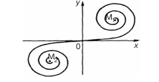
Նկ․ 2․1 Կլոտոիդ
որտեղ L-ը կլոտոիդի կտորի երկարությունն է, իսկ k-ն՝ դրա պարամետրը։
Այս գծային կախվածությունը հիմք է հանդիսանում ածանցյալների հաշվարկման բոլոր հետագա գործողությունների համար՝ մաթեմատիկական ծրագրավորումը կիրառելու համար: Խնդիրը հետևյալն է՝ գտնել տրված տիպի սփլայն, որը բավարարում է բոլոր սահմանափակումներին և լավագույնս մոտարկում է հարթության վրա կետերի տրված հաջորդականությունը (Նկ. 2․2):
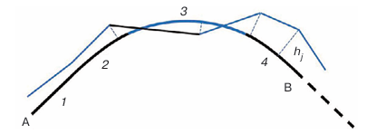
Նկ․ 2․2 Սփլայնի մեկ շղթան,1-ուղիղ,2 և 4 կլոտոիդ,3 շրջանագիծ
Սկզբնական A կետը և շոշափողի ուղղությունը դեպի ցանկալի սփլայնը այդ կետում նշված են և չեն փոխվում օպտիմալացման գործընթացի ընթացքում։
Մոտարկման որակը գնահատվում է նշված կետերի սփլայնից $h_{j}$ շեղումների քառակուսիների գումարով (Նկ. 2․2): Այլ կերպ ասած, $h_{j}$ -ն նշված կետի տեղաշարժն է դեպի իր նախագծային դիրքը. $h_{j}$ -երը հաշվարկվում են սկզբնական բեկյալի նորմալներով,այսինքն՝ երեք հարակից կետերը միացնող շրջանագծի կենտրոնի ուղղությամբ: Եթե երեք կետերը գտնվում են մեկ ուղղի վրա, ապա $h_{j}$-երը հաշվարկվում են այդ ուղղի նորմալով։
Սկզբնական կետերի տեղաշարժերը դեպի նախագծային դիրքը համարվում են դրական, եթե դրանք կատարվում են արտաքին նորմայի ուղղությամբ։
Այսպիսով, անհրաժեշտ է գտնել
$\min{F(h)} = 1 \slash 2\sum_{1}^{n}h_{j}^{2}$ (2․2)
Այստեղ $h\left( h_{1},h_{2},\cdots,h_{n} \right)$-ը անհայտների վեկտորն է, n-ը՝ նրանց թիվը։
Հիմնական փոփոխականների սահմանափակումների համակարգը պարունակում է պարզ անհավասարություններ, քանի որ յուրաքանչյուր փոփոխական սահմանափակվում է առանձին։ Ավելացվում է միայն կլոտոիդի երկարության սահմանափակում, և փոփոխական շառավղի փոխարեն դիտարկվում է փոփոխական կորություն։
$h_{j}$փոփոխականների միջոցով հնարավոր չէ արտահայտել ուղիղ գծերի, կլոտոիդի և շրջանագծերի առկայության և դիրքի պայմանները։ Մենք այս փոփոխականները համարում ենք միջանկյալ, և հիմնական փոփոխականները ուղիղ գծերի, կլոտոիդի և շրջանագծերի երկարություններն են, ինչպես նաև շրջանագծերի կորությունները։
> \*\*§2․2 Խնդրի բնութագրեր\*\*
Սփլայնը ամբողջությամբ որոշվում է առաջնային փոփոխականներով՝ հաշվի առնելով սկզբնական կետը և դրա վրա շոշափողի ուղղությունը։ Սակայն մենք չունենք միջանկյալ փոփոխականների առաջնային փոփոխականներից կախվածության վերաբերյալ վերլուծական արտահայտություններ (բանաձևեր)։Առաջնային փոփոխականների սահմանափակումները չեն արտահայտվում միջանկյալ փոփոխականներով։ (2․2) նպատակային ֆունկցիայի վերլուծական կախվածություն առաջնային փոփոխականներից չկա։
Կլոտոիդը չի կարող ներկայացվել դեկարտյան կոորդինատային համակարգում y(x) ֆունկցիայով։
Եթե կոորդինատային համակարգի սկզբնակետը համընկնում է կլոտոիդի զրոյական կորության կետի հետ, և OX առանցքը ուղղված է այս կետում շոշափողի երկայնքով (Նկ.2․1), ապա օգտագործվում է x և y կոորդինատների պարամետրիկ ներկայացումը որպես l երկարության ֆունկցիաներ, որոնք չափվում են զրոյական կորության կետից, աստիճանային շարքերի տեսքով։
$$\ \ x(l) \approx l\left( 1 - \frac{l^{4}k^{2}}{40} + \frac{l^{8}k^{4}}{3456} - ․․․ \right),$$
(2․3)
$$y(l) \approx \frac{l^{3}k}{6}\left( 1 - \frac{l^{4}k^{4}}{56} + \frac{l^{8}k^{4}}{7040} - ... \right)։$$
Կամայական կոորդինատային համակարգում գտնվող կլոտոիդի համար ստացվել են շարքի վերլուծման բանաձևերը՝ հաշվի առնելով սկզբնական կետի կոորդինատները, դրա վրա գտնվող շոշափողի անկյունը OX առանցքի հետ և կորությունը [4]:
Խնդրի նշված առանձնահատկությունների պատճառով, գրադիենտային մեթոդներով ոչ գծային ծրագրավորման խնդիր լուծելու գաղափարը թվում է անիրագործելի: Այնուամենայնիվ, ուղիղ գծերով զուգորդված շրջանագծային սփլայնային մոտարկման խնդիրը լուծվել է հենց այս կերպ [2], չնայած դիֆերենցվող ֆունկցիաների համար անալիտիկ արտահայտությունների բացակայությանը:
Ստացվել են $h_{j}$ միջանկյալ փոփոխականների ածանցյալների բանաձևերը գլխավոր փոփոխականների նկատմամբ, ապա հաշվարկվել են նպատակային ֆունկցիայի ածանցյալները գլխավոր փոփոխականների նկատմամբ [2]:
§2․3 Կլոտոիդի ինտեգրալ ներկայացումը և դրա կիրառումը
Քանի որ ցանկացած հարթ կորի համար $\sigma = \mathbb{d}\varphi \slash \mathbb{d}l$,
որտեղ σ-ն կորությունն է, $\varphi$-ն և l-ը՝ համապատասխանաբար OX առանցքի նկատմամբ շոշափողի կազմած անկյան երկարության ընթացիկ արժեքներն են, ապա (2.1)-ից
ստանում ենք՝
$${\ \ \ \ \ \ \ \ \ \ \ \ \ \ \ \ \ \ \ \ \ \ \ \ \ \ \ \ \ \ \ \ \ \ \ \ \ \ \ \ \ \ \varphi}{B} = \varphi{A} + \sigma_{A}L + kL^{2} \slash 2 = \varphi_{A} + L\left( \sigma_{A} + \sigma_{B} \right) \slash 2\ \ \ \ \ \ \ \ \ \ \ \ \ \ \ \ \ \ \ \ \ \ \ \ \ \ \ \ (2.4)$$
Ցանկացած հարթ կորի աղեղի երկարության աճի և կոորդինատների աճի միջև գոյություն ունեն $\mathbb{d}x = \cos{\varphi\mathbb{d}l}$ և $\mathbb{d}y = \sin{\varphi\mathbb{d}l}$ առնչություններ, որոնք
օգտագործելով (2.4)-ի հետ միասին ինտեգրման փոփոխականը նշանակելով t-ով, ստանում ենք կլոտոիդի պարամետրական ներկայացումը․
$$\ \ \ \ \ \ \ x(l) = x_{A} + \int_{0}^{l}{\cos\left( \frac{\varphi_{A} + \sigma_{A}t + kt^{2}}{2} \right)\mathbb{d}t},\ \ \ \ \ \ \ \ \ $$
$\ \ \ \ \ \ \ \ \ \ \ \ \ \ \ \ \ \ \ \ \ \ \ \ \ \ \ \ \ \ \ \ \ \ \ \ \ \ \ \ \ \ \ \ \ \ \ \ \ \ \ \ \ \ \ \ \ \ \ \ \ (2.5)$
$$y(l) = y_{A} + \int_{0}^{l}{\sin\left( \varphi_{A} + \sigma_{A}t + kt^{2} \slash 2 \right)\mathbb{d}t}$$
Այստեղ $x_{A}$, $y_{A}$-ն սկզբնական կետի կոորդինատներն են, իսկ l-ը՝ կլոտոիդի կտորի երկարությունը սկզբնական A կետից մինչև $x(l),$ $y(l)\ $կոորդինատներով ընթացիկ կետը։
Ստորև մենք կհիմնվենք կլոտոիդի պարամետրական (2.5) ներկայացման վրա:Դիտարկենք սփլայնի հետ տեղի ունեցող ձևափոխությունները, երբ փոխվում է միայն մեկ հիմնական փոփոխական։ Այս ձևափոխությունները հասկանալը կօգնի մեզ ստանալ բանաձևեր միջանկյալ փոփոխականների մասնակի ածանցյալների ($h_{j}$) հաշվարկման համար ըստ տարրերի երկարությունների և կորությունների, այսինքն ըստ հիմնական փոփոխականների ։
Երբ ուղիղ գծի երկարությունը փոխվում է $\Delta L$-ով, սփլայնի աջ կողմը տեղաշարժվում է այս ուղիղ գծի ուղղությամբ։ Երբ շրջանագծային աղեղի երկարությունը փոխվում է,տեղի է ունենում աղեղի վերջնակետում շոշափողի ուղղությամբ շարժում,ավելացված այդ կետում կենտրոնով $\Delta\varphi = \sigma\Delta L$ չափով պտույտ։Երբ կլոտոիդի երկարությունը փոխվում է,տեղի է ունենում հետևյալը․
1. Կլոտոիդի պարամետրը փոխվում է այնպես, որ ծայրակետում գտնվող կորությունը չի փոխվում երկարության հետ, քանի որ մենք հաշվարկում ենք մասնակի ածանցյալներ։
2. Կլոտոիդի աջ ծայրակետի (B կետ) կոորդինատները և դրա վրա գտնվող շոշափողի անկյունը OX առանցքի հետ փոխվում են։
Համաձայն (2.5)-ի
$$\left. \ \begin{matrix}
\ \ \ \ \ \ \ \ \ \ \ \ \ \ \ \ \ \ \ \ \ \ \ \ \ \ \ \ \ \ \ \ \ \ \ \ \ \ x_{B} = x_{A} + \int_{0}^{L}{\cos\left( \frac{\varphi_{A} + \sigma_{A}t + kt^{2}}{2} \right)\mathbb{d}t,} \
\ \ \ \ \ \ \ \ \ \ \ \ \ \ \ \ \ \ \ \ \ \ \ \ \ \ \ \ \ \ \ \ \ \ \ \ \ y_{B} = y_{A} + \int_{0}^{L}{\sin\left( \varphi_{A} + \sigma_{A}t + kt^{2} \slash 2 \right)\mathbb{d}t,}
\end{matrix} \right}\ \ \ \ \ \ \ \ \ \ \ \ \ \ \ \ \ \ \ \ \ \ \ \ \ \ \ \ \ \ \ \ \ \ \ \ \ \ \ \ \ \ \ \ \ \ \ \ \ (2.6)$$
$$\ \ \ \ \ \ \ \ \ \ \ \ \ \ \ \ \ \ \ \ \ \ \ \ \ \ \ \ \ \ \ \ \ \frac{\partial x_{B}}{\partial L} = \cos\varphi_{B} + \frac{\partial x_{B}}{\partial k} \cdot \frac{\partial k}{\partial L} = \cos\varphi_{B} - \frac{\partial x_{B}}{\partial k}\frac{\left( \sigma_{B} - \sigma_{A} \right)}{L^{2}},\ \ \ \ \ \ \ \ \ \ \ \ \ \ \ \ \ \ \ \ \ \ \ \ \ \ \ \ \ \ \ \ \ \ (2.7)$$
$$\ \ \ \ \ \ \ \ \ \ \ \ \ \ \ \ \ \ \ \ \ \ \ \ \ \ \ \ \ \ \ \ \ \frac{\partial y_{B}}{\partial L} = \sin\varphi_{B} + \frac{\partial y_{B}}{\partial k} \cdot \frac{\partial k}{\partial L} = \sin\varphi_{B} - \frac{\partial y_{B}}{\partial k}\frac{\left( \sigma_{B} - \sigma_{A} \right)}{L^{2}},\ \ \ \ \ \ \ \ \ \ \ \ \ \ \ \ \ \ \ \ \ \ \ \ \ \ \ \ \ \ \ \ \ \ \ (2.8)$$
այստեղ օգտագործվում է (2.1)-ից ստացված առնչությունը՝
$$\frac{\partial k}{\partial L} = - \left( \sigma_{B} - \sigma_{A} \right) \slash L^{2},$$
$$\ \ \ \ \ \ \ \ \ \ \ \ \ \ \ \ \ \ \ \ \ \ \ \ \ \ \ \ \frac{\partial\varphi B}{\partial L} = \sigma_{A} + kL + \frac{\partial k}{\partial L} \cdot \frac{L^{2}}{2} = \sigma_{A} + kL - \frac{\left( \sigma_{B} - \sigma_{A} \right)}{2} = \frac{\left( \sigma_{B} + \sigma_{A} \right)}{2}\ ։\ \ \ \ \ \ \ \ \ \ \ \ \ \ \ \ \ \ \ \ (2.9)$$
Այսպիսով, կլոտոիդի աջ կողմում տեղի է ունենում տեղաշարժ և պտույտ՝ կենտրոնանալով B կետում, մինչդեռ կլոտոիդի ներսում պետք է հաշվի առնել միայն k պարամետրի փոփոխության ազդեցությունը։
Երբ շրջանագծի կորությունը փոխվում է, ձախ և աջ կողմերում հարակից կլոտոիդի պարամետրերը փոխվում են, ինչպես նաև շրջանագծի աղեղի ծայրակետի կոորդինատները և դրա վրա շոշափողի անկյունը OX առանցքի հետ։ Այս ամենը հանգեցնում է աջ կլոտոիդի ծայրակետին հաջորդող սփլայնի մասի տեղաշարժերի և պտույտների։
Բացի այդ, շրջանագծի աղեղի ներքին կետերի՝ ձախ և աջ կլոտոիդի կոորդինատները նույնպես փոխվում են։ Անցնենք բանաձևերի ստացմանը, որոնք թույլ կտան մեզ հաշվի առնել կլոտոիդի պարամետրի փոփոխությունները։
Մեզ անհրաժեշտ կլինի չորս ինտեգրալ.
$\ \ \ \ \ \ \ \ \ \ \ \ \ \ \ \ \ \ I_{1} = \int_{0}^{L}{\sin{\left( \varphi_{A} + \sigma_{A}t + k\frac{t^{2}}{2} \right)t}\mathbb{d}t\ ,\ \ \ }I_{2} = \int_{0}^{L}{\cos{\left( \varphi_{A} + \sigma_{A}t + k\frac{t^{2}}{2} \right)t}\mathbb{d}t}$,
$$I_{3} = \int_{0}^{L}{\sin{\left( \varphi_{A} + \sigma_{A}t + k\frac{t^{2}}{2} \right)t^{2}}\mathbb{d}t,\ \ \ \ \ }I_{4} = \int_{0}^{L}{\cos{\left( \varphi_{A} + \sigma_{A}t + k\frac{t^{2}}{2} \right)t^{2}}\mathbb{d}t},$$
$$I_{1} = \frac{1}{k}\int_{0}^{L}{\sin{\left( \varphi_{A} + \sigma_{A}t + k\frac{t^{2}}{2} \right)\left( kt + \sigma_{A} - \sigma_{A} \right)}\mathbb{d}t = =}\frac{1}{k}\int_{0}^{L}{\sin{\left( \varphi_{A} + \sigma_{A}t + k\frac{t^{2}}{2} \right)d\left( \varphi_{A} + \sigma_{A}t + k\frac{t^{2}}{2} \right) -} - \frac{\sigma_{A}}{k}\int_{0}^{L}{\sin{\left( \varphi_{A} + \sigma_{A}t + k\frac{t^{2}}{2} \right)\mathbb{d}t}} =} - \frac{1}{k}\left( \cos\varphi_{B} - \cos\varphi_{A} \right) - \frac{\sigma_{A}}{k}\left( y_{B} - y_{A} \right);(2.10)$$
$$I_{2} = \frac{1}{k}\int_{0}^{L}{\cos{\left( \varphi_{A} + \sigma_{A}t + k\frac{t^{2}}{2} \right)\left( kt + \sigma_{A} - \sigma_{A} \right)}\mathbb{d}t = =}\frac{1}{k}\int_{0}^{L}{\cos{\left( \varphi_{A} + \sigma_{A}t + k\frac{t^{2}}{2} \right)d\left( \varphi_{A} + \sigma_{A}t + k\frac{t^{2}}{2} \right) -} - \frac{\sigma_{A}}{k}\int_{0}^{L}{\cos{\left( \varphi_{A} + \sigma_{A}t + k\frac{t^{2}}{2} \right)\mathbb{d}t}} =} - \frac{1}{k}\left( \sin\varphi_{B} - \sin\varphi_{A} \right) - \frac{\sigma_{A}}{k}\left( x_{B} - x_{A} \right);\ (2.11)$$
$$I_{3} = \frac{1}{k}\int_{0}^{L}{\sin{\left( \varphi_{A} + \sigma_{A}t + k\frac{t^{2}}{2} \right)t\left( kt + \sigma_{A} - \sigma_{A} \right)}\mathbb{d}t = - \frac{1}{k}\int_{0}^{L}{t\mathbb{d}\cos{(\varphi_{A} + \sigma_{A}t + k\frac{t^{2}}{2}}) - \frac{\sigma_{A}}{k}I_{1}} = -}\frac{1}{k}\left( L\cos\varphi_{B} - \left( x_{B} - x_{A} \right) \right) + \frac{\sigma_{A}}{k^{2}}\left( \left( \cos\varphi_{B} - \cos\varphi_{A} \right) + \sigma_{A}\left( y_{B} - y_{A} \right) \right);\ \ \ \ \ \ (2.12)$$
$$I_{4} = \frac{1}{k}\int_{0}^{L}{\cos{\left( \varphi_{A} + \sigma_{A}t + k\frac{t^{2}}{2} \right)t\left( kt + \sigma_{A} - \sigma_{A} \right)}\mathbb{d}t = - \frac{1}{k}\int_{0}^{L}{t\mathbb{d}\sin{(\varphi_{A} + \sigma_{A}t + k\frac{t^{2}}{2}}) - \frac{\sigma_{A}}{k}I_{2}} = -}\frac{1}{k}\left( L\sin\varphi_{B} - \left( y_{B} - y_{A} \right) \right) + \frac{\sigma_{A}}{k^{2}}\left( \left( \sin\varphi_{B} - \sin\varphi_{A} \right) + \sigma_{A}\left( x_{B} - x_{A} \right) \right);\ \ \ \ \ \ \ (2.13)$$
(2.5)-ից հետևում է․
$$\frac{\partial x_{B}}{\partial k} = - \frac{1}{2}I_{3} = \frac{1}{2k}\left( L\cos\varphi_{B} - \left( x_{B} - x_{A} \right) \right) - \frac{\sigma_{A}}{{2k}^{2}}\left( \left( \cos\varphi_{B} - \cos\varphi_{A} \right) + \sigma_{A}\left( y_{B} - y_{A} \right) \right);\ \ \ \ (2.14)$$
$$\frac{\partial y_{B}}{\partial k} = \frac{1}{2}I_{4} = \frac{1}{2k}\left( L\sin\varphi_{B} - \left( y_{B} - y_{A} \right) \right) - \frac{\sigma_{A}}{{2k}^{2}}\left( {(sin}\varphi_{B} - \sin\varphi_{A}) + \sigma_{A}\left( x_{B} - x_{A} \right) \right)։\ \ \ \ \ \ \ \ \ (2.15)$$
Ձախակողմյան կլոտոիդի համար սկզբնական կետի կորությունը և երկարությունը չեն փոխվում, երբ շրջանագծի կորությունը փոխվում է: Շրջանակի կորությունը նշանակելով $\sigma$, ինչպես նախկինում, հաշվի առնելով (2.1)-ը և (2.5)-ը, և ֆիքսելով $\sigma_{A}$-ն, ստանում ենք ․
$$\ \ \ \ \ \ \ \ \ \ \ \ \ \ \ \ \ \ \ \ \ \ \ \ \ \ \ \ \ \ \ \ \ \ \ \ \ \ \ \ \ \ \ \ \ \ \ \ \ \ \ \ \ \ \ \ \ \ \ \ \ \ \ \ \ \ \ \frac{\partial x_{B}}{\partial\sigma} = \frac{\partial x_{B}}{\partial k} \bullet \frac{1}{L},\ \ \ \ \ \ \ \ \ \ \ \ \ \ \ \ \ \ \ \ \ \ \ \ \ \ \ \ \ \ \ \ \ \ \ \ \ \ \ \ \ \ \ \ \ \ \ \ \ \ \ \ \ \ \ \ \ \ \ \ \ \ \ \ \ \ \ \ \ \ \ \ (2.16)$$
$$\ \ \ \ \ \ \ \ \ \ \ \ \ \ \ \ \ \ \ \ \ \ \ \ \ \ \ \ \ \ \ \ \ \ \ \ \ \ \ \ \ \ \ \ \ \ \ \ \ \ \ \ \ \ \ \ \ \ \ \ \ \ \ \ \ \ \frac{\partial y_{B}}{\partial\sigma} = \frac{\partial y_{B}}{\partial k} \bullet \frac{1}{L}։\ \ \ \ \ \ \ \ \ \ \ \ \ \ \ \ \ \ \ \ \ \ \ \ \ \ \ \ \ \ \ \ \ \ \ \ \ \ \ \ \ \ \ \ \ \ \ \ \ \ \ \ \ \ \ \ \ \ \ \ \ \ \ \ \ \ \ \ \ \ \ \ \ (2.17)$$
Դիտարկենք շրջանագծի $\sigma$ կորության փոփոխության ազդեցությունը աջակողմյան կլոտոիդի վրա: Սկզբնական և ծայրակետերի, ինչպես նաև երկարության համար պահպանում ենք A,B և L նշումները:
$$x_{B} = \int_{0}^{L}{\cos\left( \varphi_{A} + \sigma t + \frac{\sigma_{B} - \sigma}{L} \cdot \frac{t^{2}}{2} \right)\mathbb{d}t;}$$
$$\frac{\partial x_{B}}{\partial\sigma} = - \int_{0}^{L}{\sin{\left( \varphi_{A} + \sigma t + \frac{\sigma_{B} - \sigma}{L} \cdot \frac{t^{2}}{2} \right) \times \left( t - \frac{t^{2}}{2L} \right)}\mathbb{d}t} = - I_{1} + \frac{1}{2L}I_{3};\ \ \ \ \ \ \ \ \ \ \ \ \ \ \ \ \ (2.18)$$
$$y_{B} = \int_{0}^{L}{\sin\left( \varphi_{A} + \sigma t + \frac{\sigma_{B} - \sigma}{L} \cdot \frac{t^{2}}{2} \right)\mathbb{d}t;}$$
$$\frac{\partial y_{B}}{\partial\sigma} = \int_{0}^{L}{\cos{\left( \varphi_{A} + \sigma t + \frac{\sigma_{B} - \sigma}{L} \cdot \frac{t^{2}}{2} \right) \times \left( t - \frac{t^{2}}{2L} \right)}\mathbb{d}t} = I_{2} + \frac{1}{2L}I_{4}։\ \ \ \ \ \ \ \ \ \ \ \ \ \ \ \ \ \ \ \ \ \ \ \ (2.19)$$
Երբ $I_{1},I_{2},I_{3},I_{4}$-ը փոխարինում ենք (2.10)-(2.13)-ից (2.18) և (2.19)-ում՝ աջակողմյան կլոտոիդի համար դրանց արժեքները տեղադրելով, պետք է հիշենք, որ $\sigma_{A} = \sigma$ և $k =$($\sigma_{B} - \sigma$)$/L$:
(2.18) և (2.19) բանաձևերը կարող են օգտագործվել աջ կլոտոիդի ցանկացած ներքին C կետի կոորդինատների ածանցյալները հաշվարկելու համար՝ հիմնվելով շրջանագծի կորության վրա,$\ x_{B}$-ի փոխարեն փոխարինելով $x_{C}$-ն և $y_{C}$-ն, (2.10)-(2.13)-ում $y_{B}$-ն, $\varphi_{C}$-ն $\varphi_{B}$-ի փոխարեն, իսկ L-ը՝ կլոտոիդի երկարությունը սկզբնական A կետից մինչև այս C կետը։ Սակայն, (2.18) և (2.19) բանաձևերում L-ը ամբողջ աջ կլոտոիդի երկարությունն է A կետից մինչև B կետը։
Ավելին, (2.1) և (2.2)-ից հետևում է.
$$\ \ \ \ \ \ \ \ \ \ \ \ \ \ \ \ \ \ \ \ \ \ \ \ \ \ \ \ \ \ \ \ \ \ \ \ \ \ \ \ \ \ \ \ \ \ \ \ \ \ \ \ \ \ \ \ \ \ \ \ \ \ \ \ \ \ \ \ \ \ \ \ \ \ \ \ \ \ \ \ \frac{\partial\varphi_{\beta}}{\partial\sigma} = \frac{L}{2}\ ։\ \ \ \ \ \ \ \ \ \ \ \ \ \ \ \ \ \ \ \ \ \ \ \ \ \ \ \ \ \ \ \ \ \ \ \ \ \ \ \ \ \ \ \ \ \ \ \ \ \ \ \ \ \ \ \ \ \ \ \ \ \ \ (2.20)$$
Այստեղ $\sigma$-ն շրջանագծի կորությունն է, $\varphi_{\beta}$-ն անկյունն է կլոտոիդի ծայրակետում OX առանցքի շոշափողի հետ, և L-ը՝ նրա երկարությունը։
(2.20) բանաձևը կիրառելի է և՛ ձախ, և՛ աջ կլոտոիդի համար։
Այժմ մենք ունենք այն ամենը, ինչ մեզ անհրաժեշտ է հիմնական փոփոխականների նկատմամբ նորմալ տեղաշարժերի (միջանկյալ փոփոխականների) մասնակի ածանցյալների հաշվարկին անցնելու համար։
§ 2.4 Ըստ նորմալների տեղափոխումների ածանցյալի հաշվումը
Ածանցյալներ ուղիղ գծի երկարությամբ
Այսպիսով, հաստատվել է, որ նույնիսկ կլոտոիդների առկայության դեպքում, երբ մեկ առաջնային փոփոխական փոխվում է, բոլոր սփլայնային ձևափոխությունները վերածվում են տեղափոխությունների և պտույտների: Այժմ քայլ առ քայլ քննարկենք, թե ինչպես հաշվարկել նորմալային տեղաշարժերի ածանցյալները առաջնային փոփոխականների նկատմամբ՝ առանց համապատասխան վերլուծական կախվածությունների:
Երբ ուղիղ գծի երկարությունը փոխվում է $\delta l$-ով, սփլայնի հաջորդ մասը տեղաշարժվում է փոփոխված գծի ուղղությամբ: Այս ուղղությունը որոշվում է $OX$ առանցքի հետ ուղղի կազմած $\alpha\ $անկյունով (Նկ. 2.3): j-րդ նորմալի երկայնքով տեղաշարժի համար գործում է հետևյալ բանաձևը՝
$$\ \ \ \ \ \ \ \ \ \ \ \ \ \ \ \ \ \ \ \ \ \ \ \ \ \ \ \ \ \ \ \ \ \ \ \ \ \ \ \ \ \ \ \ \ \ \ \ \ \ \ \ \ \ \ \ \ \ \ \ \ \ \ \ \ \frac{\partial h_{j}}{\partial l} = \frac{\sin(\alpha - \beta)}{\sin\left( \gamma_{j} - \beta \right)}\ \ \ \ \ \ \ \ \ \ \ \ \ \ \ \ \ \ \ \ \ \ \ \ \ \ \ \ \ \ \ \ \ \ \ \ \ \ \ \ \ \ \ \ \ \ \ \ \ \ \ \ \ \ \ (2.21)$$
որտեղ $\beta$ -ն սփլայնի տարրին տարված շոշափողի (Նկար 2.3-ում AB գիծը) և OX առանցքի հետ կազմած անկյունն է (այն ուղիղ է՝ j-րդ նորմալի հետ հատման կետում), $\gamma_{j}$-ն նորմալի (Նկար 2.3-ում${\ C}{0}C{1}$) անկյունն է OX առանցքի հետ։ Նկար 2.3-ում C կետը նորմալի և սփլայնի հատման կետի սկզբնական դիրքն է։ Այն համապատասխանում է միջանկյալ $h_{j}$ փոփոխականի արժեքին։ $\delta l$-ի վրա $\alpha$ անկյունով որոշվող ​​ուղղությամբ տեղափոխման դեպքում AB-ն դառնում է A1B1, C կետը՝ C2, իսկ նորմալի սփլայնի հետ հատման կետը՝ C1։ Տեղաշարժի $h_{j}$-ն ստանում է ${\delta h}_{j}$ = CC1 աճ։
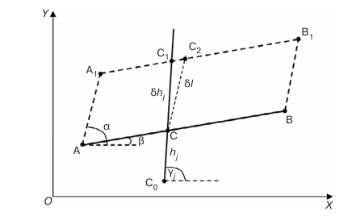
Նկ․2.3 Տեղափոխման դեպքում մասնակի ածանցյալներ
(2.20) բանաձևը բխում է սինուսների թեորեմից, եթե այն կիրառվի C1CC2 եռանկյան մեջ։ Այն ճիշտ է բոլոր նորմալների համար, որոնք հատում են սփլայնը փոփոխական գծի ծայրից աջ։
Երբ շրջանային աղեղի երկարությունը փոխվում է $\delta L$ -ով, սփլայնի ամբողջ հաջորդող մասը (սկսած աղեղի B ծայրակետից) տեղաշարժվում է $\delta L$ -ով B կետում շրջանագծի շոշափողի ուղղությամբ։Այս ուղղությունը որոշվում է OX առանցքի նկատմամբ շոշափողի կազմած $\alpha$ անկյունով։ Բացի այդ, սպլայնի աջ մասը պտտվում է $\delta\alpha = \sigma\delta L$անկյան տակ B կետի շուրջ,որտեղ σ-ն շրջանագծի կորությունն է։ Տեղաշարժը հաշվի է առնվում նույն կերպ, ինչպես ուղիղ գծի երկարությունը փոխելիս։ [2]-ում ներկայացված և հիմնավորված է (2.13) բանաձևը՝ j-րդ նորմալի երկայնքով շրջագծի աղեղի նկատմամբ տեղաշարժի ածանցյալը հաշվարկելու համար։ Մեր նշանակումների մեջ այն ունի հետևյալ տեսքը.
$$\ \ \ \ \ \ \ \ \ \ \ \ \ \ \ \ \ \ \ \ \ \ \ \ \ \ \ \ \ \frac{\partial h_{j}}{\partial L} = \frac{{\sin(\alpha - \beta) +}\lbrack\left( x_{C} - x_{B} \right)\cos\beta + \left( y_{C} - y_{B} \right)sin\beta\rbrack\sigma}{\sin\left( \gamma_{j} - \beta \right)}։\ \ \ \ \ \ \ \ \ \ \ \ \ \ \ \ \ \ \ \ \ \ \ \ \ \ (2.22)$$
Այստեղ L-ը շրջանային աղեղի երկարությունն է, $\alpha$ -ն՝ B վերջնակետում դրա նկատմամբ շոշափողի անկյունը, xC-ն և yC-ն՝ սփլայնի հատման կետի և j-րդ նորմալի կոորդինատներն են, $\beta$ -ն՝ C կետում սպլայնի նկատմամբ շոշափողի անկյունը OX առանցքի հետ, իսկ $\gamma_{j}$-ն՝ OX առանցքի նկատմամբ նորմալի անկյունը։ Այս բանաձևը հաշվի է առնում թե՛ տեղափոխությունը, թե՛ պտույտը։ Այն ճիշտ է շրջանային աղեղի վերջնակետից աջ գտնվող սփլայնը հատող ցանկացած նորմալի համար։
Կլոտոիդի երկարության փոփոխության հետ մեկտեղ, սփլայնի հաջորդ մասը տեղաշարժվում և պտտվում է կլոտոիդի աղեղի B վերջնակետում որպես կենտրոնի շուրջ։
Համապատասխանաբար, կլոտոիդից աջ j-րդ նորմալի երկայնքով տեղաշարժերի աճը ներկայացված է հետևյալ կերպ՝
$$\ \ \ \ \ \ \ \ \ \ \ \ \ \ \ \ \ \ \ \ \ \ \ \ \ \ \ \ \ \ \ \ \ \ \ \ \ \ \ \ \ \ \ \ \ \ \ \ \ \ \ \ \ \ \ \ \ \ \ \ \ \ \ \ \ \ \ \partial h_{j} = \partial h_{j}^{s} + \partial h_{j}^{r},\ \ \ \ \ \ \ \ \ \ \ \ \ \ \ \ \ \ \ \ \ \ \ \ \ \ \ \ \ \ \ \ \ \ \ \ \ \ \ \ \ \ \ \ \ \ \ \ \ \ \ \ \ \ \ \ \ \ \ (2.23)$$
որտեղ $\ \partial h_{j}^{s} - ն$ j-րդ նորմալի երկայնքով տեղաշարժի աճն է տեղաշարժի ընթացքում։
$\partial h_{j}^{r}$-ն j-րդ նորմալի երկայնքով տեղաշարժի աճն է պտտման ընթացքում։
B վերջնակետում կոորդինատների փոփոխությունը տեղի է ունենում $\partial L$-ով շոշափողի տեղաշարժի և կլոտոիդի k պարամետրի փոփոխության պատճառով, որը լրացուցիչ հանգեցնում է նորմալների և կլոտոիդի հատման կետերի կոորդինատների փոփոխության։
$\partial h_{j}^{s}$-ն հաշվարկելու համար մենք օգտագործում ենք (2.7) և (2.8) բանաձևերը, որոնք տալիս են կլոտոիդի աղեղի ծայրակետի $\partial x_{B}$ և $\partial y_{B}$ կոորդինատների աճը, որը պայմանավորված է $\partial L$ աճով։ Հաջորդող բոլոր կետերի կոորդինատները տեղաշարժի ժամանակ նույնպես կստանան նույն աճը ։ Հատկանշական է, որ այս բանաձևերի առաջին անդամները համապատասխանում են B կետում $\partial L$ -ով շոշափող տեղաշարժին, մինչդեռ երկրորդ անդամները համապատասխանում են կլոտոիդի պարամետրի փոփոխության պատճառով տեղաշարժին՝ պահպանելով կորությունը դրա սկզբնակետում և վերջնակետում։ Եթե նշանակենք OX առանցքի երկայնքով $\partial x_{B}$-ով $\partial x_{jx}$-ով և OY առանցքի երկայնքով $\partial y_{B}$-ով $\partial y_{jy}$-ով տեղաշարժի պատճառով առաջացած $h_{j}^{s}\ $աճը, ապա $\partial h_{j}^{s} = \partial h_{jx} + \partial h_{jy}$:
(2.21) բանաձևում $\partial h_{jx}$-ը հաշվարկելու համար $\partial l$-ը փոխարինեք $\partial x_{B}$-ով և $\alpha$-ն՝ 0-ով։ Ստանում ենք $\frac{\partial h_{jx}}{\partial x_{B}} = - \frac{\sin\beta}{\sin\left( \gamma_{j} - \beta \right)}$ ։
Նմանապես, $\partial h_{jy}$-ի համար $\alpha = \pi \slash 2$ դեպքում՝ $\frac{\partial h_{jy}}{\ \partial y_{B}} = \frac{\cos\beta}{\sin\left( \gamma_{j} - \beta \right)}$։
Սրանից հետևում է. $\ \ \ \ \ \partial h_{j}^{s} = - \frac{\sin\beta}{\sin\left( \gamma_{j} - \beta \right)}\ \partial x_{B} + \frac{\cos\beta}{\sin\left( \gamma_{j} - \beta \right)}\partial y_{B}$ ; (2.24)
$\ \ \ \ \ \ \ \ \ \ \ \ \ \ \ \ \ \ \ \ \ \ \ \ \ \ \ \ \ \ \ \ \ \ \ \frac{\partial h_{j}^{s}}{\partial L} = - \frac{\sin\beta}{\sin\left( \gamma_{j} - \beta \right)} \bullet \frac{\partial x_{B}}{\partial L} +$ $\frac{\cos\beta}{\sin\left( \gamma_{j} - \beta \right)} \bullet \frac{\partial y_{B}}{\partial L};$ (2.25)
$\frac{\partial x_{B}}{\partial L}\ $ և $\frac{\partial y_{B}}{\partial L} - ի\ $ ածանցյալները համապատասխանում են (2.7) և (2.8) բանաձևերին, որոնցում, $\frac{\partial x_{B}}{\partial k}\ ,$ $\frac{\partial y_{B}}{\partial k}$-ը, համապատասխանաբար, պետք է փոխարինվեն (2.14) և (2.15) բանաձևերից ստացված իրենց արտահայտություններով։ Կլոտոիդի ներսում նորմալներով հատման կետերի համար,(2.22)-ում, (2.6) և (2.7)-ի փոխարեն, մենք պետք է օգտագործենք հետևյալ արտահայտությունները`
$\frac{\partial x_{C}}{\partial L} = - \frac{\partial x_{C}}{\partial k} \cdot \frac{\left( \sigma_{B} - \sigma_{A} \right)}{L^{2}}$ և $\frac{\partial y_{C}}{\partial L} = - \frac{\partial y_{C}}{\partial k} \cdot \frac{\left( \sigma_{B} - \sigma_{A} \right)}{L^{2}}$
և ածանցյալները` $\frac{\partial x_{C}}{\partial k}$, $\frac{\partial y_{C}}{\partial k}$ հաշվարկվում են (2.13) և (2.14) բանաձևերով՝ $x_{B}$, $y_{B}$-ի փոխարեն $x_{C}$, $y_{C}$-ով։ $\varphi_{B}$-ի փոխարեն $\varphi_{C}$-ով, իսկ L-ի փոխարեն՝ կլոտոիդի երկարությունը սկզբնակետից մինչև B վերջնակետը։
$\partial h_{j}^{r}$-ն հաշվարկելու համար մենք պետք է հաշվի առնենք կլոտոիդի B-ի վերջնակետի շուրջ սփլայնի հաջորդ մասի պտույտը $\partial\varphi_{B}$անկյան տակ։ [2]-ում ստացվել է բանաձև j-րդ նորմալի երկայնքով տեղաշարժերի ածանցյալների հաշվարկման համար պտտման անկյան նկատմամբ, որը մեր նշանակումների մեջ ունի հետևյալ տեսքը.
$$\frac{\partial h_{j}^{r}}{\partial\varphi_{B}} = \frac{\left( x_{C} - x_{B} \right){cos\beta}{+ \left( y_{C} - y_{B} \right)\sin\beta}}{\sin\left( \gamma_{j} - \beta \right)}։$$
Հաշվի առնելով, որ (2.9) բանաձևի համաձայն՝ $\frac{\partial\varphi_{B}}{\partial L} = \left( \sigma_{B} + \sigma_{A} \right)/2$, ստանում ենք.
$$\ \ \ \ \ \ \ \ \ \ \ \ \ \ \ \ \ \ \ \ \ \ \ \ \ \ \ \ \ \ \ \ \ \ \ \ \ \frac{\partial h_{j}^{r}}{\partial L} = \frac{\left( x_{C} - x_{B} \right){cos\beta}{+ \left( y_{C} - y_{B} \right)\sin\beta}}{\sin\left( \gamma_{j} - \beta \right)} \cdot \frac{\left( \sigma_{B} + \sigma_{A} \right)}{2}։\ \ \ \ \ \ \ \ \ \ \ \ \ \ \ \ \ (2.26)$$
Այստեղ $x_{C}$-ն և $y_{C}$-ն սփլայնի հատման կետի կոորդինատներն են j-րդ նորմալի հետ, β-ն C կետում սփլայնին տարված շոշափողի և OX առանցքի կազմած անկյունն է, $\gamma_{j}$-ն նորմալի անկյունն է OX առանցքի հետ, $\sigma_{A}$-ն և $\sigma_{B}$-ն կլուտոիդի սկզբնակետում և վերջնակետում կորությունն են: Համաձայն (2.23)-ի, (2.25) և (2.26)-ի աջ կողմերի գումարը տալիս է սփլայնի հաջորդ տեղամասի համար $\frac{\partial հ_{j}}{\partial L}\ $ածանցյալը:
§2.5 Ածանցյալներ ըստ կորության
Ինչպես արդեն նշվեց, շրջանագծի σ կորության փոփոխությունը՝ պահպանելով մյուս բոլոր հիմնական փոփոխականների արժեքները, հանգեցնում է ամենաբարդ սփլայնային ձևափոխության. ձախ կլոտոիդի պարամետրը փոխվում է, ինչը հանգեցնում է տեղաշարժերի դրա ներսում, սփլայնի աջ մասը տեղաշարժվում և պտտվում է մինչև դրա վերջնակետը, շրջանագծի աղեղի ներսում տեղաշարժեր են տեղի ունենում այն ​​հատող նորմալների երկայնքով, տեղի է ունենում սփլայնի մասի լրացուցիչ տեղաշարժ և պտույտ շրջանային աղեղի վերջնակետից այն կողմ, և վերջապես, աջ կլոտոիդի պարամետրը փոխվում է, ինչը հանգեցնում է սփլայնի մասի տեղաշարժի և պտույտի այդ կլոտոիդի վերջնակետից այն կողմ և տեղաշարժի դրա ներսում։
Նորմալների երկայնքով տեղաշարժերի ածանցյալները կորության երկայնքով կհաշվարկենք հաջորդաբար՝ հատված առ հատված։
Ձախ կլոտոիդի ներսում և մինչև սփլայնի ծայրը j-րդ նորմալի և կլոտոիդի հատման C կետի համար նրա կոորդինատները նշանակենք xC, yC, կլոտոիդի աղեղի սկզբից (A կետ) մինչև C կետը եղած հեռավորությունը նշանակենք LC; C կետում շոշափողի անկյունը՝ $\varphi_{C}$; ձախ կլոտոիդի պարամետրը՝ k1: Օգտագործենք (2.14) և (2.15) բանաձևերը․
$$\frac{\partial x_{C}}{\partial k_{1}} = \frac{1}{2k_{1}}\left( L_{C}\cos\varphi_{C} - \left( x_{C} - x_{A} \right) \right) - \frac{\sigma_{A}}{2k_{1}^{2}}\left( \left( \cos\varphi_{C} - \cos\varphi_{A} \right) + \sigma_{A}\left( y_{C} - y_{A} \right) \right);\ \ \ \ \ \ \ (2.27)$$
$$\frac{\partial y_{C}}{\partial k_{1}} = \frac{1}{2k_{1}}\left( L_{C}\sin\varphi_{C} - \left( y_{C} - y_{A} \right) \right) - \frac{\sigma_{A}}{2k_{1}^{2}}\left( \left( \sin\varphi_{B} - \sin\varphi_{A} \right) + \sigma_{A}\left( x_{C} - x_{A} \right) \right)։\ \ \ \ \ \ \ \ \ (2.28)$$
Ըստ (2.16), (2.17)-ի $\frac{\partial x_{C}}{\partial\sigma} = \frac{\partial x_{C}}{\partial k_{1}} \cdot \frac{1}{L}$ և $\frac{\partial y_{C}}{\partial\sigma} = \frac{\partial y_{C}}{\partial k_{1}} \cdot \frac{1}{L}\ ,$որտեղ L-ը կլոտոիդի AB աղեղի երկարությունն է։
Կոորդինատների աճը (2.24)-ի համաձայն տալիս է նորմալ տեղաշարժի աճը
$$\ \ \ \ \ \ \ \ \ \ \ \partial h_{j}^{s} = - \frac{\sin\beta}{\sin\left( \gamma_{j} - \beta \right)}\partial x_{C} + \frac{\cos\beta}{\sin\left( \gamma_{j} - \beta \right)}\partial y_{C}։$$
Ձախ կլոտոիդի ներսում j-րդ նորմալի երկայնքով տեղաշարժի շրջանագծի կորության նկատմամբ համապատասխան ածանցյալի համար ստանում ենք՝
$\ \ \ \ \ \ \ \ \ \ \ \ \ \ \ \ \ \ \ \ \ \ \ \ \ \ \ \ \ \ \ \ \ \ \ \ \ \frac{\partial h_{j}^{s}}{\partial\sigma} = ( - \frac{\sin\beta}{\sin\left( \gamma_{j} - \beta \right)} \bullet \frac{\partial x_{C}}{\partial k_{1}} +$ $\frac{\cos\beta}{\sin\left( \gamma_{j} - \beta \right)} \bullet \frac{\partial y_{C}}{\partial k_{1}})/L։$ (2.28)
Այստեղ, ինչպես նախկինում, β-ն նորմալի հետ հատման C կետում սփլայնին տարված շոշափողի և OX առանցքի կազմած անկյունն է, և $\gamma_{j}$-ն նորմալի անկյունն է OX առանցքի հետ։
Ձախ կլոտոիդից աջ գտնվող սփլայնը հատող նորմալների համար (2.27) և (2.28) բանաձևերը պետք է կիրառվեն B վերջնակետի վրա, և արդյունքը պետք է փոխարինվի (2.28) բանաձևով, որտեղ β և $\gamma_{j}$ անկյունները վերաբերվում են համապատասխան նորմալին։ Այդ նույն նորմալների համար կլոտոիդից B կետում շոշափողի պտտման պատճառով առաջացող ածանցյալը $\frac{\partial h_{j}^{s}}{\partial\sigma}\ $հաշվարկվում է (2.28)-ի կիրառմամբ և $\frac{\partial\varphi_{B}}{\partial\sigma} = \frac{L}{2}$, որը հետևում է (2.4)-ից։ Արդյունքում, նորմալի և ձախ կլոտոիդից աջ գտնվող սփլայնի հատման կամայական C կետի համար ստանում ենք՝
$\ \ \ \ \ \ \ \ \ \ \ \ \ \ \ \ \ \ \ \ \ \ \ \ \ \ \ \ \ \ \ \ \ \ \frac{\partial h_{j}^{r}}{\partial\sigma} = \frac{\left( x_{C} - x_{B} \right)cos\beta + {\left( y_{C} - y_{B} \right)\sin}\beta}{\sin\left( \gamma_{j} - \beta \right)} \bullet \frac{L}{2}$ ։ (2.29)
Միասին, (2.28) և (2.29)-ը տալիս են $\frac{\partial հ_{j}}{\partial\sigma} = \frac{\partial h_{j}^{s}}{\partial\sigma} + \frac{\partial h_{j}^{r}}{\partial\sigma}$։ (2.30)
Բացի վերը նշվածի, շրջանագծի աղեղի ներսում նորմալների հետ հատման կետերի կոորդինատներում փոփոխություններ են տեղի ունենում՝ շրջանագծի կորության փոփոխությունների պատճառով։ [1]-ում ստացված (2.17) բանաձևը՝ շրջանագծի ներսում գտնվող նորմալների նկատմամբ $հ_{j}$տեղաշարժերի մասնակի ածանցյալները R շառավղի նկատմամբ հաշվարկելու համար, ունի հետևյալ տեսքը՝
$$\frac{\delta h_{j}}{\delta R} = \frac{\cos{(\beta - \alpha) - 1}}{\sin\left( \gamma_{j} - \beta \right)}։$$
Այս բանաձևում α-ն և β-ն շրջանագծի աղեղի սկզբնակետում և վերջնակետում տարված շոշափողների կազմած անկյուններն են OX առանցքի հետ, $\gamma_{j}$-ն՝ j-րդ նորմալի անկյունն է։Մեր նշումներում, շրջանագծի ներսում գտնվող նորմալների նկատմամբ տեղաշարժերի կորության նկատմամբ ածանցյալի համար ստանում ենք՝
$\ \ \ \ \ \ \ \ \ \ \ \ \ \ \ \ \ \ \ \ \ \ \ \ \ \ \ \ \ \ \ \ \ \ \ \ \ \ \ \ \ \ \ \frac{\partial h_{j}^{s1}}{\partial\sigma} = \frac{1 + \cos\left( \beta - \varphi_{B} \right)}{\sin{\left( \gamma_{j} - \beta \right)\sigma^{2}}}։\ \ \ \ \ \ \ $ (2.31)
Արդյունքում, շրջանային աղեղը հատող նորմալների երկայնքով տեղաշարժերի ածանցյալների համար ստանում ենք՝
$\ \ \ \ \ \ \ \ \ \ \ \ \ \ \ \ \ \ \ \ \ \ \ \ \ \ \ \ \ \ \ \ \ \ \ \ \ \ \ \ \ \ \ \ \frac{\partial հ_{j}}{\partial\sigma} = \frac{\partial h_{j}^{s}}{\partial\sigma} + \frac{\partial h_{j}^{r}}{\partial\sigma} + \frac{\partial h_{j}^{s1}}{\partial\sigma}։\ \ \ \ \ \ \ \ \ \ \ \ \ \ \ \ \ \ \ \ \ \ \ \ \ \ \ \ \ \ \ \ \ \ \ $ (2.32)
Բացի այդ, տեղի է ունենում սփլայնի ամբողջ հաջորդող մասի տեղաշարժ շրջանային աղեղի վերջնակետից (B կետ) և դրա պտույտ՝այդ կետում կենտրոնով σ կորության փոփոխության պատճառով։
[1]-ից (2.14), (2.15) բանաձևերին համապատասխան, շառավղից անցնելով կորության, ստանում ենք՝
$$\ \ \ \ \ \ \ \ \ \ \ \ \ \ \ \ \ \ \ \ \ \ \ \ \ \ \ \ \ \ \ \ \ \ \ \ \ \ \ \ \ \ \ \ \ \ \ \frac{\partial x_{B}}{\partial\sigma} = - \frac{{sin\beta}{- \sin\alpha} - (\beta - \alpha)\cos\beta}{\sigma^{2}}։\ \ \ \ \ \ \ \ \ \ \ \ \ \ \ \ \ \ \ \ \ \ \ \ \ \ \ \ \ \ \ \ \ \ \ \ \ \ \ (2.33)$$
$$\ \ \ \ \ \ \ \ \ \ \ \ \ \ \ \ \ \ \ \ \ \ \ \ \ \ \ \ \ \ \ \ \ \ \ \ \ \ \ \ \ \ \ \ \ \ \frac{\partial y_{B}}{\partial\sigma} = - \frac{\cos\alpha - cos\beta - (\beta - \alpha)\sin\beta}{\sigma^{2}}։\ \ \ \ \ \ \ \ \ \ \ \ \ \ \ \ \ \ \ \ \ \ \ \ \ \ \ \ \ \ \ \ \ \ \ \ \ \ \ \ (2.34)$$
Այստեղ α-ն և β-ն համապատասխանաբար շրջանագծի աղեղին սկզբնակետում և վերջնակետում տարված շոշափողների և OX առանցքի հետ կապված անկյուններն են։
Օգտագործենք (2.24) բանաձևը, որը թույլ է տալիս x և y կոորդինատների երկայնքով տեղաշարժերը վերածել նորմալի երկայնքով տեղաշարժերի, շրջանագծի վերջնակետում տեղաշարժից առաջացող նորմալների երկայնքով տեղաշարժերի ածանցյալների համար ստանում ենք՝
$\ \ \ \ \ \ \ \ \ \ \ \ \ \ \ \ \ \ \ \ \ \ \ \ \ \ \ \ \ \ \ \ \ \ \ \ \frac{\partial h_{j}^{s2}}{\partial\sigma} = - \frac{\sin\beta_{1}}{\sin\left( \gamma_{j} - \beta_{1} \right)}$ $\bullet$ $\frac{\partial x_{B}}{\partial\sigma} + \frac{\cos\beta_{1}}{\sin\left( \gamma_{j} - \beta_{1} \right)}$ $\bullet$ $\frac{\partial y_{B}}{\partial\sigma}\ :\ \ \ \ \ \ \ \ \ $ (2.35)
Այստեղ $\beta_{1}$-ը j-րդ նորմալի և սփլայնի հատման կետում տարված շոշափողի կազմած անկյունն է OX առանցքի հետ, $\gamma_{j}$-ն՝այդ նորմալի անկյունն է OX առանցքի հետ։
(2.33)-ից և (2.34)-ից $\frac{\partial x_{B}}{\partial\sigma}$ և $\frac{\partial y_{B}}{\partial\sigma}$ (2.35)-ում տեղադրելով և պարզեցնելով, ստանում ենք՝
$$\ \ \ \ \ \ \ \ \ \ \ \ \ \ \ \ \ \ \ \ \ \ \frac{\partial h_{j}^{s2}}{\partial\sigma} = - \frac{\cos{\left( \beta_{1} - \alpha \right) - \cos{\left( \beta_{1} - \beta \right) + (\beta - \alpha)\sin\left( \beta_{1} - \beta \right)}}}{\sin{\left( \gamma_{j} - \beta_{1} \right)\sigma^{2}}}:\ \ \ \ \ \ \ \ \ \ \ \ \ (2.36)$$
$\ $Պետք է հաշվի առնելշրջանագծի վերջնակետում գտնվող շոշափողը պտտելու հետևանքները, երբ դրա կորությունը փոխվում է, նույն կերպ, ինչպես արվել է վերևում ձախ կլոտոիդի վերջնակետում գտնվող շոշափողը պտտելու համար: Համաձայն (2.26)-ի՝
$$\frac{\partial h_{j}^{r2}}{\partial\varphi_{B}} = \frac{\left( x_{C} - x_{B} \right)\cos\beta + {\left( y_{C} - y_{B} \right)\sin}\beta\ }{\sin\left( \gamma_{j} - \beta \right)}\ :\ \ \ \ \ \ \ \ \ \ \ $$
Այստեղ, $x_{C}$-ն և $y_{C}$-ն սփլայնի հատման կետի կոորդինատներն են j-րդ նորմալի հետ, β-ն այդ C կետում սփլայնին տարված շոշափողի և OX առանցքի կազմած անկյունն է,
$\gamma_{j}$-ն՝նորմալի անկյունն է OX առանցքի հետ, $\varphi_{B}$-ն՝ շրջանագծի աղեղի վերջնակետում տարված շոշափողի կազմած անկյունն է։Հաշվի առնելով, որ B շրջանագծի համար
$\frac{\partial\varphi_{B}}{\partial\sigma} = L$ ,որտեղ L-ը շրջանագծի աղեղի երկարությունն է, ստանում ենք՝
$$\ \ \ \ \ \ \ \ \ \ \ \ \ \ \ \ \ \ \ \ \ \ \ \ \ \ \ \ \ \ \ \ \ \ \ \ \ \ \ \ \ \ \ \ \ \ \frac{\partial h_{j}^{r2}}{\partial\varphi_{B}} = \frac{\left( x_{C} - x_{B} \right)\cos\beta + {\left( y_{C} - y_{B} \right)\sin}\beta\ }{\sin\left( \gamma_{j} - \beta \right)}L:\ \ \ \ \ \ \ \ \ \ \ \ \ \ \ \ \ \ \ \ \ \ \ \ \ \ \ \ \ \ \ \ \ \ (2.37)$$
(2.36) և (2.37) բանաձևերը ճիշտ են նորմալների և սփլայնի հատման բոլոր կետերի համար, ոչ միայն աջ կլոտոիդի ներսում, այլև մինչև սփլայնի վերջը։ Շրջանագծի կորության փոփոխությունների ազդեցությունը աջ կլոտոիդի վրա նույնպես հաշվի է առնվում։
§2.6 Օբյեկտիվ ֆունկցիայի գրադիենտի հաշվարկ
Օպտիմալացման ալգորիթմի սկզբնական մոտավորությունը սփլայնն է, որը ստացվում է դինամիկ ծրագրավորման մեթոդը իրականացնող առանձին ծրագրի միջոցով [1]: Այս սփլայնն օգտագործվում է նշված տեղորոշման կետերի տեղաշարժերը նորմալների երկայնքով դեպի նախագծային դիրքը (Նկ. 2.2): Սրանք միջանկյալ փոփոխականների hj ընթացիկ արժեքներն են: Դրանք որոշելու համար սպլայնի տարրերը հաջորդաբար դիտարկվում են՝ սկսած սկզբնական գծից:Յուրաքանչյուր տարրի (գծի, կլոտոիդի, շրջանագծի) համար պահվում է այն հատող առաջին նորմալի թիվը:
Նորմալների շրջանագծի հետ հատման կետերը որոշելու համար օգտագործվում է [1]-ից (2.9) բանաձևը:Կլոտոիդի հետ հատումները գտնելու համար օգտագործվում է իտերատիվ ալգորիթմ: Հաջորդը, յուրաքանչյուր հիմնական փոփոխականի՝ xi-ի համար (տարրերի երկարությունը և շրջանակների կորությունը), հաջորդաբար որոշվում է առաջին նորմալ ji-ի թիվը, որի տեղաշարժը ազդվում է համապատասխան հիմնական փոփոխականի փոփոխությամբ: Այս նորմայի երկայնքով տեղաշարժը ազդում է համապատասխան առաջնային փոփոխականի փոփոխություններից:Գծերի և շրջանագծերի երկարությունների համար սա հաջորդ տարրը հատող առաջին նորմալի թիվն է։ Կլոտոիդի երկարության համար սա այն հատող առաջին նորմալի թիվն է, շրջանագծի կորության համար սա ձախ կլոտոիդը հատող առաջին նորմալի թիվն է։Բոլոր տարրերի վերջնական նորմալի թիվը վերջին n նորմալի թիվն է։
Սկզբնական նպատակային ֆունկցիայի (2.2) ածանցյալները հիմնական փոփոխականների նկատմամբ հաշվարկվում են հետևյալ բանաձևով՝
$\frac{\partial F\left( h(x) \right)}{\partial x_{i}} = \sum_{j = j_{i}}^{n}{h_{j}\frac{\partial h_{j}}{\partial x_{j}}}\ \ :\ \ \ \ \ \ \ \ \ \ \ \ \ \ \ \ \ \ \ \ \ \ \ \ \ \ \ \ \ \ \ \ \ \ \ \ \ \ \ \ \ \ \ \ \ \ \ \ \ \ \ \ \ $(2.38)
Այստեղ x-ը և h-ը համապատասխանաբար հիմնական և միջանկյալ փոփոխականների վեկտորներն են։ Սփլայնի պարամետրերը օպտիմալացնելու համար օգտագործվում են նույն փոփոխված Լագրանժի ֆունկցիան [5] և նույն ալգորիթմը [6], ինչպես գծային հատվածներից և շրջանային աղեղներից բաղկացած սփլայնի համար [2]։ Դրան հասնելու համար գրադիենտը հաշվարկելիս (2.38)-ի աջ կողմին ավելացվում է տուգանային ֆունկցիայի [2] ածանցյալը։
§2.7Առաջարկված խնդրի տվյալների ներմուծում
Կլոտոիդ(Էյլերի փաթույթ կամ Կորնյուի կոր)
Ինչպես ստորև նշել ենք այն կորը,որի կորությունը տրվում է $k(s) = \frac{S}{A_{0}^{2}}$ բանաձևով,կոչվում է կլոտոիդ,որտեղ $S$-ը կլոտոիդի աղեղի երկարությունն է՝ հաշված սկզբնակետից,իսկ $A_{0}$-ն տրված խնդրի պայմանների դեպքում հաստատուն է։
Հայտնի է,որ անցումային կորով,այսինքն կլոտոիդով շարժվելիս,վարորդը պետք է հասցնի սահուն ձևով պտտի ղեկը,դրա համար ծախսելով 2-3 վարկյան։
Իմանալով շարժման միջին V արագությունը,կարելի է հաշվել կլոտոիդի անհրաժեշտ երկարությունը՝ L=V*t,որտեղից էլ կարելի է որոշել $A_{0}$ պարամետրը*(որը պետք է բավարարի $A_{0}$>R/3 պայմանին)։
Դիցուք շրջանի շառավիղը՝ R=600մ,շարժման միջին արագությունը՝V=100կմ/ժ ≈28մ/վ,ղեկի պտտման տևողությունը՝ t=3վրկ։Այդ դեպքում $L = V \bullet t = 84\ մ$
Հետևաբար՝հաշվի առնելով,որ $k(L)$=1/R,կստանանք $A_{0} = \sqrt{RL} = \sqrt{50400} \approx 224,5$
Կլոտոիդի $x = x(s)$ և $y = y(s)$ պարամետրական հավասարումների համար կունենանք հետևյալ մոտարկող առնչությունները՝
$$\left{ \begin{array}{r}
x = x(s) = s - \frac{s^{5}}{40A_{0}^{4}} + \frac{s^{9}}{3456A_{0}^{8}} \
\ y = y(s) = \frac{s^{3}}{6A_{0}^{2}} - \frac{s^{7}}{336A_{0}^{6}} + \frac{s^{11}}{42240A_{0}^{10}}
\end{array} \right.\ $$
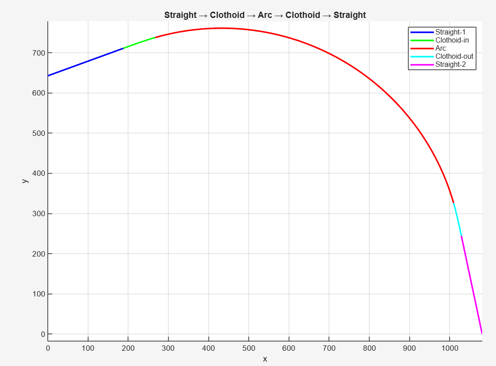
Նկ 2.4 Ավտոմայրուղու նախագծում կլոտոիդի օգնությամբ
Խորանարդային սփլայն(բնական սփլայն)
Դիցուք այժմ տրված են $P_{0},\ P_{1}$, $P_{2},P_{3}$, $P_{4}$ կետեր։Ստանանք այդ կետերով անցնող խորանարդային սփլայն,որով կներկայացվի ավտոմայրուղին(միավոր հատվածը 10 մ է)։
$P_{0}(4;4),\ P_{1}(9;7),P_{2}(12;3),P_{3}(16;11)$, $P_{4}(20;13)$
${tg}\alpha = S_{0}՛\left( P_{0} \right)$,${tg}\beta = S_{3}՛\left( P_{4} \right)$։
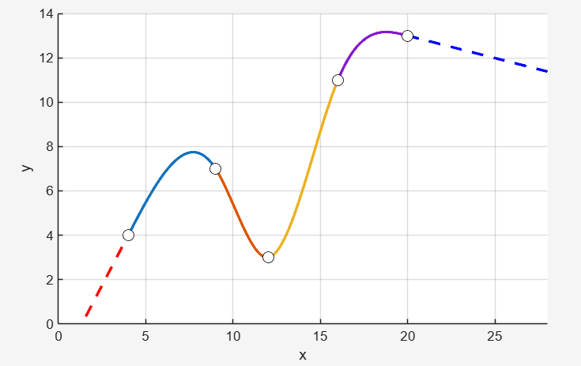
Նկ 2.5 Խորանարդային սփլայնով ավտոմայրուղի
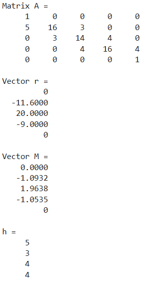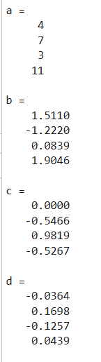 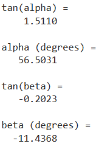
Այժմ դիտարկենք ավտոմայրուղու նախագծման օրինակ՝ Բեզյեի կորի օգնությամբ(խորանարդային սփլայնը ինտերպոլյացիա է,իսկ Բեզյեի կորը ապրոկսիմացիա)։Ինչպես հայտնի է Բեզյեի կորը չի անցնում (որպես կանոն) հենակետերով,բացի իհարկե եզրային կետերից։Հետևաբար եթե ավտոմայրուղու նախագծողն ասում է որ ճանապարհը պետք է անցնի տրված $P$ կետով,ապա պետք է․
կամ հատուկ ձևով ընտրել հենակետերը,
կամ ճանապարհը պետք է տրոհել երկու Բեզյե-սեգմենտների։
Կիրառենք երկու Բեզյեի-սեգմենտների տրոհման սխեման։
Դիցուք ճանապարհը պետք է անցնի $P_{0}(0;0),\ P_{1}(100;20),P_{2}(200;0)$ կետերով։Նրա համար,որպեսզի $P_{1}\ $կետը հաստատ պատկանի մայրուղուն,կառուցենք երկու խորանարդային Բեզյեի կորեր․
Առաջին սեգմենտ․ $B_{1}(t),\ 0 \leq t \leq 1$, հենակետերն են $P_{0},A,B,P_{1}$։
Երկրորդ սեգմենտ․ $B_{2}(t),\ 0 \leq t \leq 1$, հենակետերն են $P_{1},C,D,P_{2}$։
Այսպիսով․
$B_{1}^{'}(1) = 3\left( P_{1} - B \right)$ $B_{2}^{'}(0) = 3\left( C - P_{1} \right)$
$B_{1}^{'}(0) = 3\left( A - P_{0} \right)\ \ \ \ \ \ \ \ \ \ \ \ \ \ \ \ \ \ \ \ \ \ B_{2}^{'}(1) =$<!-- -->3$\left( D - P_{2} \right)$
$P_{1}$ կետում ողորկություն ապահովելու համար պետք է պահանջել․
$$B_{1}^{'}(1) = B_{2}^{'}(0)$$
$$P_{1} - B = \ C - P_{1}$$
$$C = 2P_{1} - B\ \ \ \ \ \ \ \ \ \ \ \ \ \ \ \ \ \ \ \ \ \ \ \ \ \ \ \ \ \ \ \ \ \ \ \ \ \ \ \ \ \ \ \ \ \ \ \ \ \ \ \ \ \ \ \ \ \ \ \ \ \ \ \ \ \ \ \ \ \ \ \ \ \ (*)$$
Վերջին պայմանը նշանակում է,որ $B;$ $P_{1};\ C$ կետերը պետք է գտնվեն մեկ ուղղի վրա(սա ապահովում է ղեկի պտտման անկյան թռիչքի բացակայություն)։
Պահանջենք նաև,որ $P_{1}$ կետում ունենանք $C^{2}$ դասի ողորկություն։Քանի որ
$B_{1}^{''}(1) = 6\left( P_{1} - 2B + A \right)$ ; $B_{2}^{''}(0) = 6\left( {D - 2C + P}_{1} \right)$ ;
Ուստի ${\ \ B}{1}^{''}(1) = B{2}^{''}(0)$; $\ $
$$A - 2B = D - 2C\ \ \ \ \ \ \ \ \ \ \ \ \ \ \ \ \ \ \ \ \ \ \ \ \ \ \ \ \ \ \ \ \ \ \ \ \ \ \ \ \ \ \ \ \ \ \ \ \ \ \ \ \ \ \ \ \ \ \ \ \ \ \ \ (**)$$
(սա ապահովում է կողային արագացման թռիչքի բացակայություն)։
Կամայական ձևով ընտրենք $A(50;15),\ B(80;20):$ Այդ դեպքում $(*)$-ից կստանանք․
$$C(120;20):$$
Տեղադրելով $(**)$-ի մեջ կստանանք․
$$D(130;15):$$
Այսպիսով,առաջին սեգմենտը պետք է կառուցել $P_{0}(0;0),$ $A(50;15),\ B(80;20),\ P_{1}(100;20)$ կետերով,իսկ երկրորդ սեգմենտը՝$\ P_{1}(100;20)$, $C(120;20),$ $D(130;15)$, $P_{2}(200;0)$ հենակետերով(Նկ 2․6)։
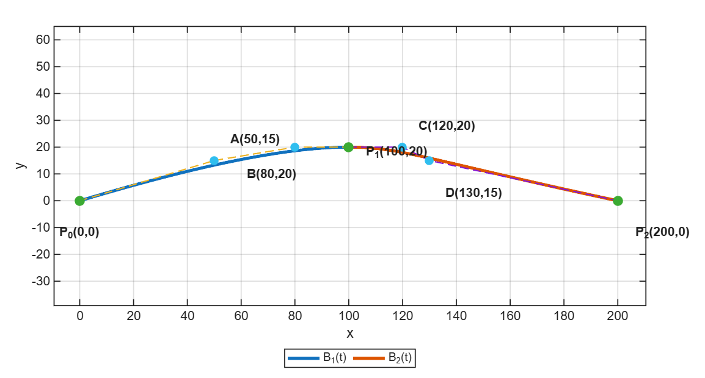
Նկ․ 2․6 Երկու խորանարդային Բեզյեի կորերով կառուցված ավտոմայրուղի
